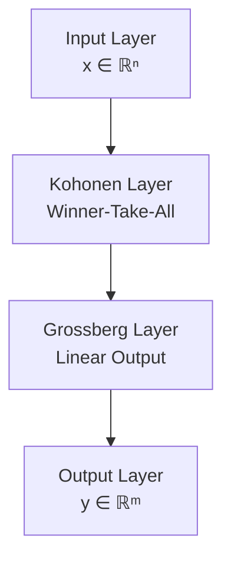

# Technical Deep Dives: Mathematical Foundations & Algorithms

## Mathematical Foundations of Hecht-Nielsen's Neural Networks

---

## Table of Contents

1. [Associative Memory Networks](#associative-memory-networks)
2. [Hebbian Learning](#hebbian-learning)
3. [Counterpropagation Networks](#counterpropagation-networks)
4. [Self-Organizing Maps](#self-organizing-maps)
5. [Backpropagation Theory](#backpropagation-theory)
6. [Kolmogorov's Mapping Theorem](#kolmogorovs-mapping-theorem)

---

## Associative Memory Networks

### Mathematical Foundation

Associative memory networks store patterns and retrieve them based on partial or noisy inputs, mimicking human memory recall.

#### Weight Matrix Construction

Given a set of patterns **X** = {**x**₁, **x**₂, ..., **x**ₚ} where each **x**ᵢ ∈ {-1, +1}ⁿ

The weight matrix **W** is constructed using the Hebbian outer product rule:

```
W = Σᵢ₌₁ᵖ xᵢ · xᵢᵀ - p·I
```

Where:
- **xᵢ** is the i-th pattern (column vector)
- **xᵢᵀ** is its transpose (row vector)
- **p** is the number of stored patterns
- **I** is the identity matrix
- The diagonal term (-p·I) prevents self-connections

#### Retrieval Process

Given a partial or noisy input **y**, the network retrieves the complete pattern:

```
x̂ = sgn(W · y)
```

Where sgn() is the sign function:
```
sgn(v) = { +1  if v ≥ 0
         { -1  if v < 0
```

#### Storage Capacity

The theoretical storage capacity of an associative memory network is:

```
Pₘₐₓ ≈ 0.138 · n
```

Where **n** is the number of neurons. This means a network with 1000 neurons can reliably store approximately 138 patterns.

#### Energy Function

The network operates by minimizing an energy function:

```
E = -½ · yᵀ · W · y
```

The system converges to local minima representing stored patterns.

---

## Hebbian Learning

### The Hebbian Principle

**"Cells that fire together, wire together"**

### Mathematical Formulation

The basic Hebbian learning rule updates weights based on correlated activity:

```
Δwᵢⱼ = η · xᵢ · yⱼ
```

Where:
- **wᵢⱼ** is the weight from neuron i to neuron j
- **η** is the learning rate
- **xᵢ** is the input from neuron i
- **yⱼ** is the output of neuron j

### Matrix Form

For a layer of neurons:

```
ΔW = η · x · yᵀ
```

Where:
- **W** is the weight matrix
- **x** is the input vector
- **y** is the output vector

### Normalized Hebbian Learning

To prevent unbounded weight growth:

```
Δwᵢⱼ = η · (xᵢ · yⱼ - α · wᵢⱼ · yⱼ²)
```

Where **α** is a decay constant.

### Oja's Rule (Normalized Hebbian)

```
Δwᵢⱼ = η · yⱼ · (xᵢ - yⱼ · wᵢⱼ)
```

This maintains bounded weights and performs principal component analysis.

---

## Counterpropagation Networks

### Architecture

Counterpropagation networks combine two layers:
1. **Kohonen Layer** (competitive, unsupervised)
2. **Grossberg Layer** (supervised, outstar)



### Kohonen Layer (Competitive Learning)

#### Finding the Winner

For input **x**, find the neuron k with maximum similarity:

```
k = argmaxⱼ (wⱼᵀ · x / ||wⱼ|| · ||x||)
```

Or equivalently, minimum distance:

```
k = argminⱼ ||x - wⱼ||²
```

#### Weight Update (Winner Only)

```
wₖ(t+1) = wₖ(t) + η(t) · [x - wₖ(t)]
```

With decreasing learning rate:

```
η(t) = η₀ · (1 - t/T)
```

Where **T** is the maximum number of iterations.

#### Normalization

Weights are typically normalized:

```
wₖ = wₖ / ||wₖ||
```

### Grossberg Layer (Outstar)

Maps the winning Kohonen neuron to the desired output:

```
yᵢ = Σⱼ vᵢⱼ · zⱼ
```

Where:
- **vᵢⱼ** is the weight from Kohonen neuron j to output neuron i
- **zⱼ** is 1 if j is the winner, 0 otherwise

#### Training the Grossberg Layer

```
Δvᵢₖ = β · (dᵢ - vᵢₖ)
```

Where:
- **k** is the winning Kohonen neuron
- **dᵢ** is the desired output for neuron i
- **β** is the learning rate

---

## Self-Organizing Maps (SOM)

### Mathematical Model

SOM creates a low-dimensional (typically 2D) representation of high-dimensional data.

#### Network Structure

- **Input:** x ∈ ℝⁿ
- **Map:** Grid of neurons with positions **r** ∈ ℝ²
- **Weights:** Each neuron has weight vector **wᵣ** ∈ ℝⁿ

#### Training Algorithm

**Step 1: Find Best Matching Unit (BMU)**

```
r* = argminᵣ ||x - wᵣ||²
```

**Step 2: Update Neighborhood**

```
wᵣ(t+1) = wᵣ(t) + η(t) · h(r, r*, t) · [x - wᵣ(t)]
```

Where **h(r, r*, t)** is the neighborhood function:

```
h(r, r*, t) = exp(-||r - r*||² / 2σ²(t))
```

**Step 3: Decrease Parameters**

```
η(t) = η₀ · exp(-t/τ₁)
σ(t) = σ₀ · exp(-t/τ₂)
```

Where:
- **η(t)** is the learning rate at time t
- **σ(t)** is the neighborhood radius at time t
- **τ₁, τ₂** are time constants

#### Topological Ordering

The key property of SOMs is that nearby neurons in the map respond to similar inputs, preserving the topology of the input space.

---

## Backpropagation Theory

### Forward Pass

For a network with layers **L** = {0, 1, ..., L}:

**Layer l activations:**

```
aˡⱼ = f(zˡⱼ)
```

Where:

```
zˡⱼ = Σᵢ wˡⱼᵢ · aˡ⁻¹ᵢ + bˡⱼ
```

- **wˡⱼᵢ** is weight from neuron i in layer l-1 to neuron j in layer l
- **bˡⱼ** is bias for neuron j in layer l
- **f()** is the activation function (sigmoid, tanh, ReLU, etc.)

### Backward Pass (Gradient Computation)

**Error at output layer L:**

```
δᴸⱼ = ∂C/∂zᴸⱼ = (aᴸⱼ - yⱼ) · f'(zᴸⱼ)
```

Where:
- **C** is the cost function
- **yⱼ** is the target output

**Error propagation:**

```
δˡⱼ = [Σₖ wˡ⁺¹ₖⱼ · δˡ⁺¹ₖ] · f'(zˡⱼ)
```

**Gradients:**

```
∂C/∂wˡⱼᵢ = aˡ⁻¹ᵢ · δˡⱼ
∂C/∂bˡⱼ = δˡⱼ
```

### Weight Update

Using gradient descent:

```
wˡⱼᵢ(t+1) = wˡⱼᵢ(t) - η · ∂C/∂wˡⱼᵢ
bˡⱼ(t+1) = bˡⱼ(t) - η · ∂C/∂bˡⱼ
```

### Activation Functions

**Sigmoid:**
```
f(z) = 1/(1 + e⁻ᶻ)
f'(z) = f(z) · (1 - f(z))
```

**Hyperbolic Tangent:**
```
f(z) = tanh(z) = (eᶻ - e⁻ᶻ)/(eᶻ + e⁻ᶻ)
f'(z) = 1 - f(z)²
```

**ReLU (Rectified Linear Unit):**
```
f(z) = max(0, z)
f'(z) = { 1 if z > 0
        { 0 if z ≤ 0
```

### Cost Functions

**Mean Squared Error:**
```
C = ½ · Σⱼ (aᴸⱼ - yⱼ)²
```

**Cross-Entropy:**
```
C = -Σⱼ [yⱼ · ln(aᴸⱼ) + (1-yⱼ) · ln(1-aᴸⱼ)]
```

---

## Kolmogorov's Mapping Theorem

### Theorem Statement

Hecht-Nielsen explored Kolmogorov's superposition theorem for neural networks:

**Any continuous function f: [0,1]ⁿ → ℝ can be represented as:**

```
f(x₁, ..., xₙ) = Σᵢ₌₀²ⁿ gᵢ(Σⱼ₌₁ⁿ φᵢⱼ(xⱼ))
```

Where:
- **φᵢⱼ** are continuous one-dimensional functions
- **gᵢ** are continuous one-dimensional functions
- Only 2n+1 hidden neurons are needed

### Neural Network Interpretation

This theorem provides theoretical justification that:
1. A three-layer network can approximate any continuous function
2. The number of hidden neurons can be bounded
3. The approximation can be arbitrarily accurate

### Practical Implications

While theoretically important, Kolmogorov's construction:
- Is not practical for learning (functions are not trainable)
- Proves existence but not efficient computation
- Motivated research into universal approximation capabilities

---

## Universal Approximation Theorem

### Theorem

A feedforward network with:
- One hidden layer
- Finite number of neurons
- Sigmoidal activation function

Can approximate any continuous function on a compact set to arbitrary accuracy.

### Mathematical Formulation

For any ε > 0 and continuous function f on [0,1]ⁿ, there exists:

```
F(x) = Σⱼ₌₁ᴹ vⱼ · σ(wⱼᵀ·x + bⱼ)
```

Such that:

```
|f(x) - F(x)| < ε  for all x ∈ [0,1]ⁿ
```

Where:
- **M** is the number of hidden neurons
- **σ** is a sigmoidal function
- **wⱼ, vⱼ, bⱼ** are trainable parameters

---

## Fraud Detection Mathematics

### Feature Engineering

Transform transaction **t** into feature vector **x**:

```
x = [x₁, x₂, ..., xₙ]ᵀ
```

Typical features:
- **x₁:** Transaction amount (normalized)
- **x₂:** Time since last transaction
- **x₃:** Geographic distance from last transaction
- **x₄:** Merchant category deviation
- **x₅:** Velocity (transactions per hour)
- ... (100+ features total)

### Risk Score Computation

```
risk_score = σ(Wᴸ · aᴸ⁻¹ + bᴸ)
```

Where **σ** is sigmoid: **σ(z) = 1/(1+e⁻ᶻ)**

### Decision Rule

```
decision = { APPROVE  if risk_score < θ₁
           { REVIEW   if θ₁ ≤ risk_score < θ₂
           { DECLINE  if risk_score ≥ θ₂
```

Thresholds **θ₁, θ₂** are tuned to balance:
- False positive rate (legitimate transactions blocked)
- False negative rate (fraudulent transactions approved)
- Operational review capacity

### Performance Metrics

**Precision:**
```
P = TP / (TP + FP)
```

**Recall (Detection Rate):**
```
R = TP / (TP + FN)
```

**F1 Score:**
```
F₁ = 2·P·R / (P + R)
```

**ROC AUC:** Area under Receiver Operating Characteristic curve

Where:
- **TP** = True Positives (fraud correctly identified)
- **FP** = False Positives (legitimate flagged as fraud)
- **FN** = False Negatives (fraud missed)
- **TN** = True Negatives (legitimate correctly approved)

---

## Online Learning

### Incremental Weight Updates

For streaming data (like transaction processing):

```
wᵢⱼ(t+1) = wᵢⱼ(t) + η · δⱼ · xᵢ + α · Δwᵢⱼ(t-1)
```

Where:
- **η** is learning rate
- **α** is momentum term
- **δⱼ** is error signal

### Adaptive Learning Rate

```
η(t) = η₀ / (1 + decay · t)
```

### Catastrophic Forgetting Prevention

Use regularization to maintain performance on old patterns:

```
L = L_new + λ · Σᵢⱼ Fᵢⱼ · (wᵢⱼ - w*ᵢⱼ)²
```

Where:
- **L_new** is loss on new data
- **Fᵢⱼ** is Fisher information (importance of parameter)
- **w*ᵢⱼ** is old parameter value
- **λ** controls regularization strength

---

## Computational Complexity

### Forward Pass

**Time Complexity:** O(W)

Where W is the total number of weights:
```
W = Σₗ₌₁ᴸ (nₗ · nₗ₋₁)
```

For fully connected layers with **nₗ** neurons in layer l.

### Backpropagation

**Time Complexity:** O(W)

Same as forward pass - backpropagation is not more expensive!

### Training Complexity

For **N** training examples, **E** epochs:

**Total Time:** O(E · N · W)

### Space Complexity

**Memory:** O(W + N · n)

Where:
- **W** weights stored
- **N** training examples
- **n** features per example

---

## Optimization Algorithms

### Stochastic Gradient Descent (SGD)

```
w(t+1) = w(t) - η · ∇C_batch
```

### SGD with Momentum

```
v(t+1) = α · v(t) - η · ∇C
w(t+1) = w(t) + v(t+1)
```

Where **α ∈ [0,1]** is momentum coefficient (typically 0.9).

### Adam Optimizer

```
m(t) = β₁ · m(t-1) + (1-β₁) · ∇C
v(t) = β₂ · v(t-1) + (1-β₂) · (∇C)²

m̂(t) = m(t) / (1 - β₁ᵗ)
v̂(t) = v(t) / (1 - β₂ᵗ)

w(t+1) = w(t) - η · m̂(t) / (√v̂(t) + ε)
```

Where:
- **β₁** = 0.9 (first moment decay)
- **β₂** = 0.999 (second moment decay)
- **ε** = 10⁻⁸ (numerical stability)

---

## Regularization Techniques

### L2 Regularization (Weight Decay)

```
C_total = C + (λ/2N) · Σᵢⱼ w²ᵢⱼ
```

Updates become:

```
w(t+1) = (1 - ηλ/N) · w(t) - η · ∇C
```

### L1 Regularization (Lasso)

```
C_total = C + (λ/N) · Σᵢⱼ |wᵢⱼ|
```

Promotes sparse weights.

### Dropout

During training, randomly set neuron activations to zero with probability **p**:

```
ã = { 0        with probability p
    { a/(1-p)  with probability 1-p
```

This prevents co-adaptation of neurons.

---

## Batch Normalization

Normalize layer inputs during training:

```
μ_batch = (1/m) · Σᵢ xᵢ
σ²_batch = (1/m) · Σᵢ (xᵢ - μ_batch)²

x̂ᵢ = (xᵢ - μ_batch) / √(σ²_batch + ε)

yᵢ = γ · x̂ᵢ + β
```

Where **γ** and **β** are learnable parameters.

---

## Practical Implementation Tips

### Weight Initialization

**Xavier/Glorot Initialization:**

```
w ~ U(-√(6/(nᵢₙ + nₒᵤₜ)), √(6/(nᵢₙ + nₒᵤₜ)))
```

**He Initialization (for ReLU):**

```
w ~ N(0, √(2/nᵢₙ))
```

### Learning Rate Scheduling

**Step Decay:**
```
η(epoch) = η₀ · drop_rate^floor(epoch/epochs_drop)
```

**Exponential Decay:**
```
η(t) = η₀ · e^(-λt)
```

**Cosine Annealing:**
```
η(t) = η_min + ½(η_max - η_min)(1 + cos(πt/T))
```

---

## Conclusion

These mathematical foundations underpin Robert Hecht-Nielsen's contributions to neural networks. His work bridged theoretical understanding with practical implementation, enabling the commercial success of neural network applications.

For code implementations of these algorithms, see the [implementations directory](../implementations/).

---

**Further Reading:**

- Hecht-Nielsen, R. (1989). *Neurocomputing*. Addison-Wesley.
- Haykin, S. (2009). *Neural Networks and Learning Machines*. Pearson.
- Goodfellow, I., Bengio, Y., & Courville, A. (2016). *Deep Learning*. MIT Press.

---

**Last Updated:** January 2025
