# Visualizations: Robert Hecht-Nielsen's Impact on AI

## Impact on the AI Field

### Influence Network Diagram

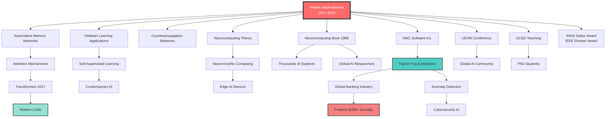

---

## Technology Evolution Timeline

```mermaid
timeline
    title Evolution of Neural Networks: Hecht-Nielsen's Contributions

    section First Wave (1980s)
        1980 : Early Neural Network Research
             : Academic interest revival
        1982 : Hopfield Networks
             : Associative memory concept
        1985 : Hecht-Nielsen: Counterpropagation
             : Novel architecture design
        1986 : Backpropagation popularized
             : Rumelhart, Hinton, Williams
        1986 : HNC Software founded
             : First commercial NN company
        1987 : IJCNN established
             : Neural network community grows
        1989 : Neurocomputing textbook
             : First comprehensive resource

    section Second Wave (1990s)
        1990 : Falcon fraud detection deployed
             : First major commercial success
        1992 : Support Vector Machines
             : Competition to neural nets
        1995 : Recurrent networks advance
             : LSTM invented
        1998 : LeNet for digit recognition
             : Convolutional networks
        1999 : HNC Software goes public
             : Neural network industry matures

    section AI Winter (2000s)
        2002 : HNC acquired by FICO
             : Consolidation phase
        2006 : Deep learning renaissance begins
             : Hinton's deep belief networks
        2009 : ImageNet dataset
             : Preparation for deep learning

    section Deep Learning Era (2010s)
        2012 : AlexNet breakthrough
             : CNN revolution
        2014 : GANs introduced
             : Generative models
        2015 : ResNet deep architectures
             : Very deep networks
        2017 : Transformers and Attention
             : Echoes of associative memory
        2018 : BERT and GPT
             : NLP revolution

    section Modern AI (2020s)
        2020 : GPT-3 large language models
             : Scale and emergence
        2022 : ChatGPT mainstream AI
             : Hecht-Nielsen's vision realized
        2023 : Multimodal AI systems
             : GPT-4, Claude, Gemini
        2024 : AI in production everywhere
             : Fraud detection, NLP, vision
        2025 : Neuromorphic computing rises
             : Brain-inspired hardware
```

---

## Neural Network Architectures

### Associative Memory Network Architecture

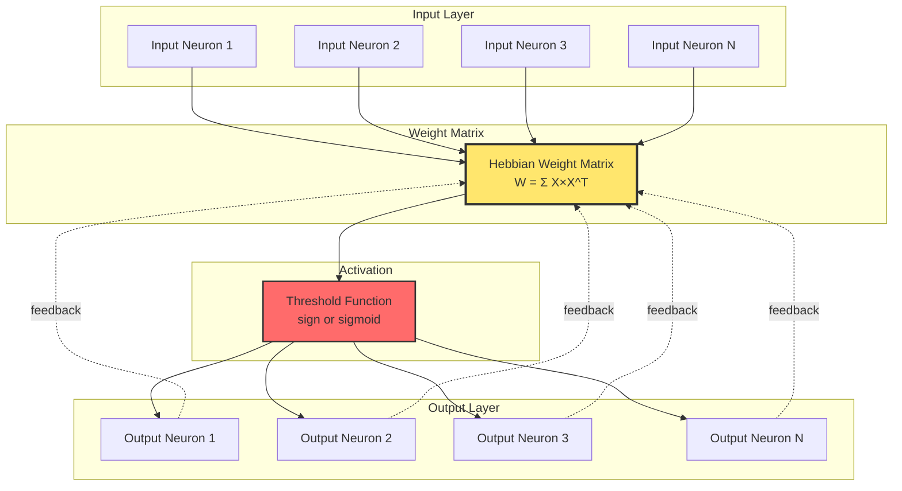

### Counterpropagation Network

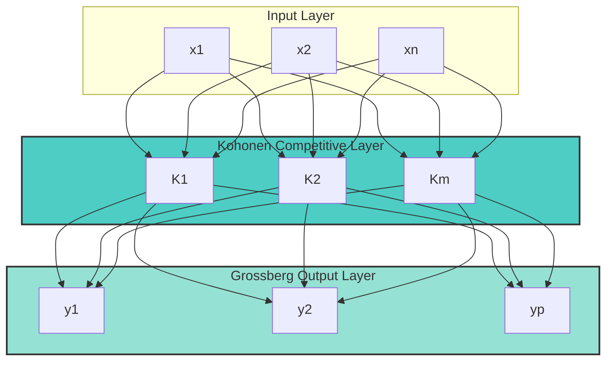

---

## Falcon Fraud Detection System Architecture

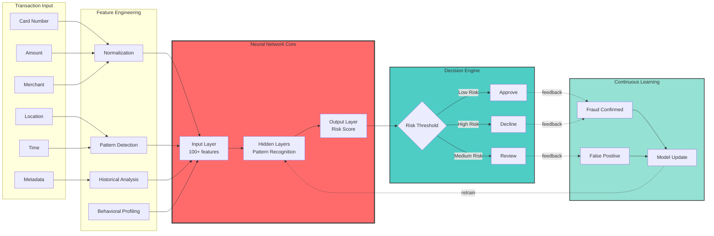

---

## Self-Organizing Map (SOM) Visualization

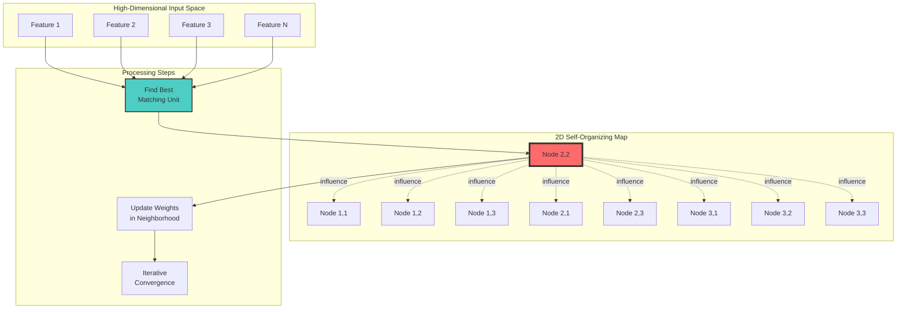

---

## Learning Process Comparison

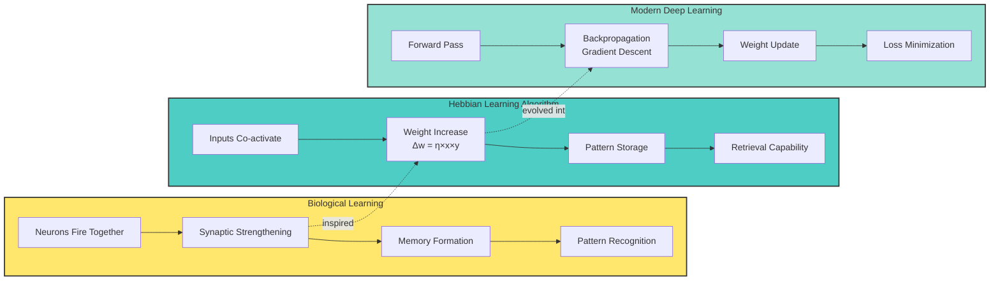

---

## Research Impact Network

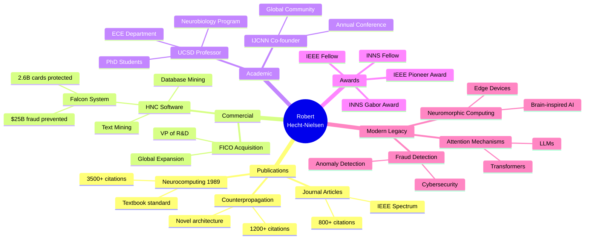

---

## Citation Impact Over Time

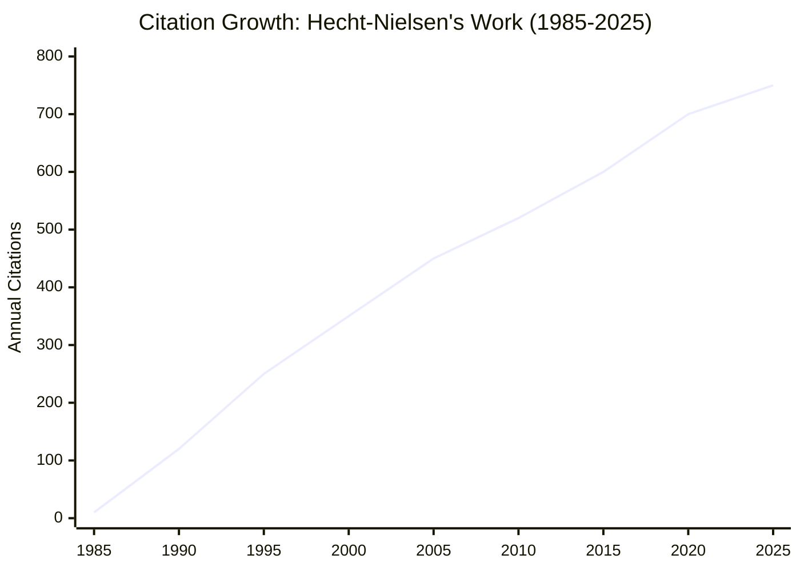

---

## Technology Adoption Timeline

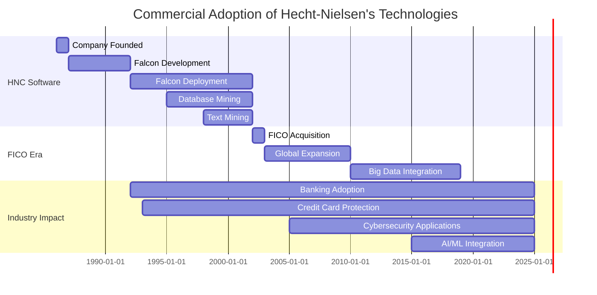

---

## Hebbian Learning Process Flow

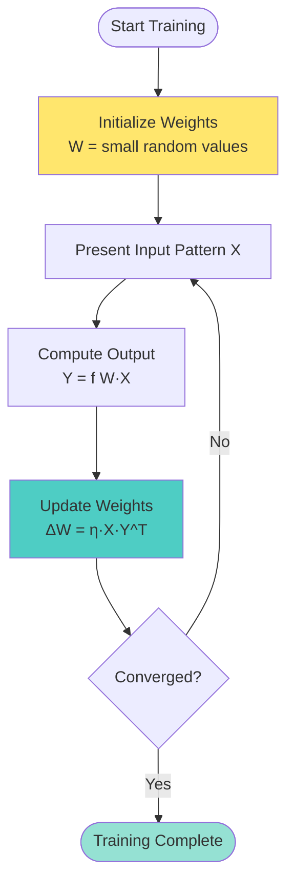

---

## Associative Memory Retrieval Process

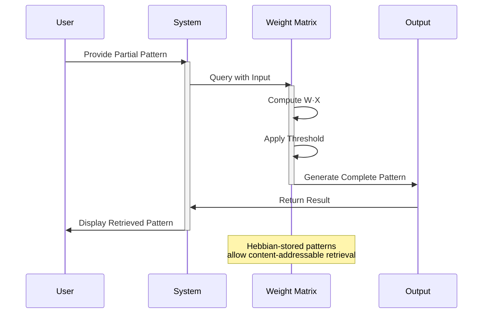

---

## Historical Context: Computing Evolution

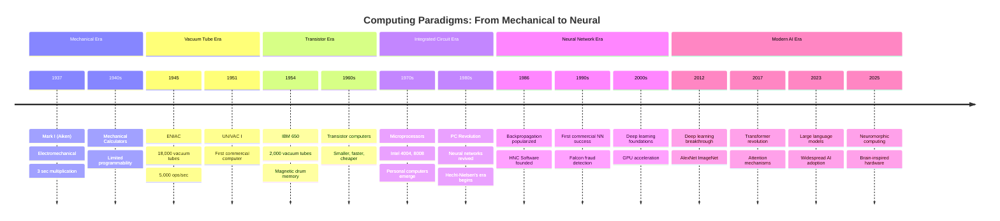

---

## Key Concepts Relationships

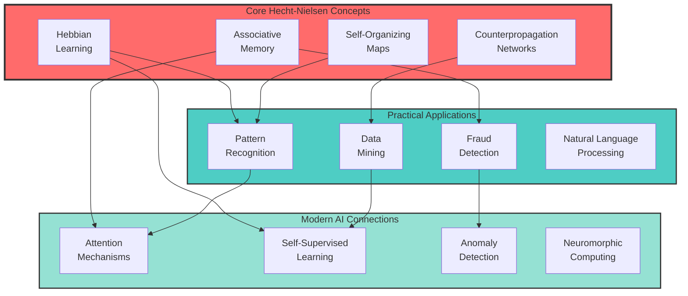
