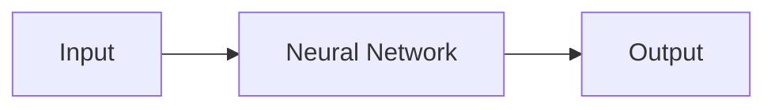

# Images & Visual Assets

This directory contains images, photos, diagrams, and other visual assets for the Robert Hecht-Nielsen archive.

---

## Directory Structure

```
images/
├── historical/          # Historical photos and documents
├── diagrams/           # Technical diagrams and schematics
├── screenshots/        # Software and system screenshots
├── portraits/          # Photos of Robert Hecht-Nielsen
├── infographics/       # Data visualizations and infographics
└── generated/          # Generated visualizations and renders
```

---

## Needed Images

### High Priority

#### Portraits
- [ ] **hecht-nielsen-portrait.jpg** - Professional photo
- [ ] **hecht-nielsen-young.jpg** - Early career photo
- [ ] **hecht-nielsen-ucsd.jpg** - At UC San Diego

#### Historical
- [ ] **hnc-software-logo.png** - Company logo
- [ ] **falcon-system-screenshot.jpg** - Falcon system interface
- [ ] **neurocomputing-book-cover.jpg** - 1989 book cover
- [ ] **ijcnn-conference-1987.jpg** - First IJCNN conference

#### Technical Diagrams
- [ ] **associative-memory-architecture.png** - Architecture diagram
- [ ] **counterpropagation-network.png** - Network structure
- [ ] **hebbian-learning-visualization.png** - Learning process
- [ ] **som-topology-map.png** - Self-organizing map example
- [ ] **falcon-architecture.png** - Fraud detection pipeline

#### Awards & Recognition
- [ ] **inns-gabor-award.jpg** - Award ceremony photo
- [ ] **ieee-pioneer-award.jpg** - IEEE award photo

### Medium Priority

#### Research Context
- [ ] **neural-network-timeline.png** - Historical timeline
- [ ] **ai-evolution-chart.png** - AI progress chart
- [ ] **citation-network.png** - Citation impact visualization

#### Commercial Impact
- [ ] **hnc-stock-graph.png** - HNC Software growth
- [ ] **fico-acquisition-announcement.jpg** - Acquisition news
- [ ] **fraud-statistics-chart.png** - Fraud prevention impact

---

## Image Guidelines

### File Naming
- Use lowercase with hyphens: `descriptive-file-name.ext`
- Include date if relevant: `ijcnn-1987-conference.jpg`
- Use descriptive names: `hebbian-learning-diagram.png` not `image1.png`

### File Formats
- **Photos:** JPG (high quality, 90% compression)
- **Diagrams:** PNG (for clarity) or SVG (vector)
- **Screenshots:** PNG
- **Logos:** SVG or high-res PNG with transparency

### Image Sizes
- **Portraits:** 800x800px minimum
- **Technical diagrams:** 1200px wide minimum
- **Screenshots:** Full resolution, then scaled in markdown
- **Thumbnails:** 300px wide

### Optimization
- Compress images appropriately
- Use WebP for web display when possible
- Keep original high-resolution versions
- Include alt text in documentation

---

## Copyright & Attribution

### Source Requirements

All images must be:
- Public domain, OR
- Licensed under CC-BY, CC-BY-SA, or compatible license, OR
- Used with explicit permission, OR
- Fair use for educational/archival purposes

### Attribution Template

```markdown

*Caption describing the image*
**Credit:** Photographer/Source | License: CC-BY-4.0
```

### Fair Use

For copyrighted materials used under fair use:
- Include proper attribution
- Use only what's necessary
- Non-commercial, educational purpose
- Document source in `CREDITS.md`

---

## Placeholder Images

Until actual images are obtained, we use placeholders:

### Portrait Placeholder
```markdown

*Robert Hecht-Nielsen, neural network pioneer and entrepreneur*
**Note:** Image pending - please contribute if you have historical photos!
```

### Diagram Placeholder
```markdown

*Neural network-based fraud detection pipeline*
**Note:** Diagram in development - see visualizations.md for Mermaid version
```

---

## Contributing Images

### How to Contribute

1. **Check copyright** - Ensure you have rights to contribute
2. **Optimize** - Compress and resize appropriately
3. **Name properly** - Follow naming conventions
4. **Add attribution** - Include source information
5. **Submit PR** - Create pull request with images

### Submission Checklist
- [ ] Image is properly licensed or public domain
- [ ] File is optimized (reasonable size)
- [ ] Filename follows naming convention
- [ ] Attribution included (if required)
- [ ] Alt text written for accessibility
- [ ] Located in appropriate subdirectory

---

## Image Sources

### Potential Sources

**Historical Photos:**
- UC San Diego archives
- IEEE Computer Society archives
- INNS photo collections
- Personal collections (with permission)
- Published conference proceedings

**Technical Diagrams:**
- Original papers (with permission)
- Recreated based on descriptions
- Generated from code implementations
- Educational resources

**Company Materials:**
- FICO corporate archives
- Press releases and media kits
- Annual reports (historical)
- Marketing materials

---

## Mermaid Diagrams

For many visualizations, we use Mermaid instead of static images:

**Advantages:**
- Version controllable
- Searchable text
- Easy to modify
- No image optimization needed
- Renders in GitHub markdown

**Example:**


See `docs/visualizations.md` for extensive Mermaid diagrams.

---

## Future Plans

### Planned Additions

- [ ] Interactive SVG diagrams
- [ ] Animated GIFs of learning processes
- [ ] Video demonstrations
- [ ] 3D visualizations of networks
- [ ] Comparison charts (then vs now)

### Tools for Creation

**Diagram Creation:**
- Mermaid (text-based diagrams)
- Draw.io / diagrams.net (flowcharts)
- TikZ (LaTeX diagrams)
- D3.js (interactive visualizations)

**Image Editing:**
- GIMP (free, open source)
- Inkscape (vector graphics)
- ImageMagick (batch processing)

**Optimization:**
- TinyPNG (compression)
- SVGO (SVG optimization)
- ImageOptim (Mac)

---

## Credits

See `CREDITS.md` for detailed attribution of all images and visual assets.

---

## Contact

For image contributions or copyright questions:
- Open an issue on GitHub
- Tag with `images` label
- Contact project maintainers

---

**Last Updated:** January 19, 2025

Thank you for helping build a comprehensive visual archive! 📸
