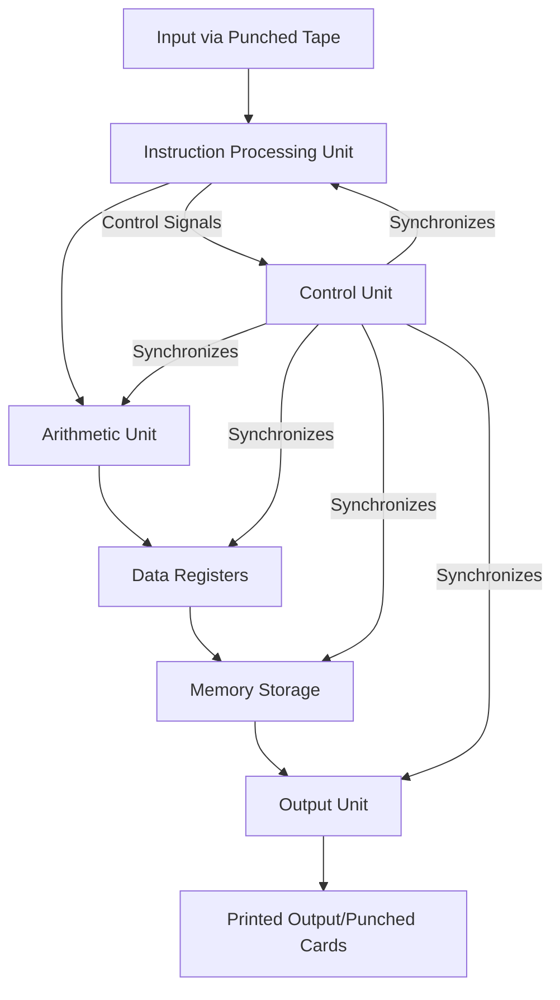

Tell me about the Mark I designed in 1937 by Harvard graduate student Howard H. Aiken.

ChatGPT said:
ChatGPT
The Mark I, also known as the IBM Automatic Sequence Controlled Calculator (ASCC), was one of the earliest electromechanical computers. It was designed by Harvard graduate student Howard H. Aiken in 1937 and completed in 1944 with the support of IBM. The Mark I was a pioneering machine in the history of computing, bridging the gap between mechanical calculators and modern electronic computers.

Key Features and Specifications:
Design and Construction: The Mark I was a large machine, measuring about 51 feet in length, 8 feet in height, and 2 feet in depth. It consisted of over 750,000 individual components, including switches, relays, rotating shafts, and clutches. The machine was built using electromechanical relays, which made it slower than later fully electronic computers but more reliable than purely mechanical systems.

Operation: The Mark I operated using punched paper tape, which was used to input instructions and data. The machine could perform basic arithmetic operations such as addition, subtraction, multiplication, and division. It also supported more complex operations like trigonometric functions, logarithms, and square roots.

Programming: The Mark I was not programmable in the modern sense, as it lacked the ability to store instructions in memory. Instead, instructions were input sequentially, and the machine executed them one by one. The programming was done using punched cards, and each instruction was executed in a predetermined sequence.

Speed: The Mark I was relatively slow compared to modern standards, taking about 3 seconds to perform a multiplication and 1 second for addition or subtraction. Despite its speed limitations, the Mark I was a significant achievement for its time and could operate continuously for extended periods.

Historical Significance: The Mark I was one of the first large-scale calculators used for scientific research and complex calculations. It played a crucial role during World War II, particularly in computations related to the Manhattan Project. The machine's development marked a critical step in the evolution of computing technology.

Legacy: The Mark I's success laid the groundwork for future developments in computing. Howard Aiken's work on the Mark I led to further advancements, including the development of the Mark II, Mark III, and Mark IV computers, which were progressively more advanced and closer to the concept of modern computers.

The Mark I remains an iconic machine in the history of computing, representing the transition from mechanical calculation devices to the electronic computers that would follow in the coming decades.

You said:
Can you give me the mark one's data-flow in mermaid file output?
ChatGPT said:
ChatGPT
Certainly! Below is a mermaid diagram file output that represents the data flow of the Mark I:

mermaid
Copy code

This diagram illustrates the basic flow of data within the Mark I:

Input via Punched Tape: Data and instructions were input into the machine through punched paper tape.
Instruction Processing Unit: The instructions from the punched tape were processed sequentially.
Arithmetic Unit: The machine performed arithmetic operations such as addition, subtraction, multiplication, and division.
Data Registers: Intermediate results were stored in registers.
Memory Storage: Data and results were stored in the machine's memory.
Output Unit: Results were output either through printed output or punched cards.
Control Unit: The control unit synchronized the operations of all other units to ensure proper execution of instructions.
This data flow reflects the sequential nature of the Mark I's operation, where each step is controlled and processed one at a time.

You said:
Why do you say 'relatively' slow? 
ChatGPT said:
ChatGPT
I used the term "relatively slow" to provide context by comparing the Mark I's speed to that of modern computers or even later computers developed in the 1940s and 1950s. While the Mark I was a groundbreaking machine for its time, its operation speed was much slower compared to the electronic computers that followed.

Here's a bit more detail:

Mark I's Speed: The Mark I took about 3 seconds to perform a multiplication and around 1 second for an addition or subtraction. This was considered quite fast compared to human computation or earlier mechanical calculators, but slow compared to later developments.

Comparison with Later Machines: Within a decade of the Mark I's creation, fully electronic computers like the ENIAC (Electronic Numerical Integrator and Computer) were developed. ENIAC, for instance, could perform 5,000 additions or subtractions per second, orders of magnitude faster than the Mark I. This leap in speed was due to the transition from electromechanical relays to electronic vacuum tubes, which could switch states much more quickly.

Modern Context: When we think about computing speed today, modern processors can perform billions of operations per second (gigahertz range). Comparing the Mark I's speed to today's standards highlights how computing technology has evolved, making the Mark I's operation speed seem slow in hindsight.

So, the term "relatively slow" acknowledges that while the Mark I was a significant technological achievement for its era, it was slow compared to what came afterward and what we have today.

You said:
Tell me about the vacuum tube follow on computers. 
ChatGPT said:
ChatGPT
The vacuum tube follow-on computers marked a significant leap forward in the evolution of computing technology. These machines, developed primarily in the late 1940s and 1950s, replaced the electromechanical relays used in earlier computers like the Mark I with vacuum tubes, leading to substantial improvements in speed, reliability, and computational power. Here’s an overview of some of the key vacuum tube computers:

1. ENIAC (Electronic Numerical Integrator and Computer)
Development: ENIAC was the first general-purpose electronic digital computer. It was designed and built by John Mauchly and J. Presper Eckert at the University of Pennsylvania and completed in 1945.
Architecture: ENIAC used approximately 18,000 vacuum tubes, which could switch states much faster than electromechanical relays, allowing it to perform calculations at unprecedented speeds.
Performance: ENIAC could perform around 5,000 additions or subtractions per second, 357 multiplications per second, or 38 divisions per second. This was a dramatic increase in speed compared to earlier machines like the Mark I.
Operation: Unlike the Mark I, ENIAC was programmable through rewiring its cables and setting switches, which allowed it to perform a variety of tasks, though reprogramming was cumbersome and time-consuming.
2. EDVAC (Electronic Discrete Variable Automatic Computer)
Development: EDVAC was designed by John von Neumann and others at the University of Pennsylvania and completed in 1949. It introduced the stored-program concept, where both data and instructions were stored in memory.
Architecture: EDVAC used around 6,000 vacuum tubes and 12,000 diodes, along with a mercury delay line for memory.
Innovation: The stored-program architecture, where instructions could be stored and manipulated in the same memory space as data, was a groundbreaking advancement. This architecture became the foundation for most future computers.
3. UNIVAC I (Universal Automatic Computer I)
Development: UNIVAC I was the first commercially produced computer in the United States, designed by J. Presper Eckert and John Mauchly and completed in 1951.
Commercial Success: UNIVAC I was the first computer to be sold commercially, with the first unit delivered to the U.S. Census Bureau. A total of 46 units were built and used by various government agencies and private companies.
Performance: It used around 5,000 vacuum tubes and could perform approximately 1,000 additions per second. It was also one of the first computers to be capable of handling both numeric and alphabetic information.
Legacy: UNIVAC I gained fame for accurately predicting the outcome of the 1952 U.S. presidential election, which demonstrated the potential of computers for data processing in various fields.
4. IBM 701
Development: IBM 701, also known as the Defense Calculator, was IBM’s first commercial scientific computer, introduced in 1952. It was part of IBM’s early move into the computing market.
Architecture: The IBM 701 used approximately 4,000 vacuum tubes and was capable of processing both scientific and business applications.
Applications: The IBM 701 was used primarily for scientific research and defense-related calculations. It was employed in the development of nuclear weapons and other Cold War projects.
Success: A total of 19 units were produced, and its success helped establish IBM as a leader in the computer industry.
5. IBM 650
Development: The IBM 650 was introduced in 1954 as a more affordable and smaller computer compared to the IBM 701. It was one of the first mass-produced computers, with over 2,000 units built.
Architecture: The IBM 650 used around 2,000 vacuum tubes and was designed to be easy to operate and maintain. It used a drum memory, which stored data on a rotating magnetic drum.
Popularity: The IBM 650 became extremely popular in universities, research institutions, and businesses due to its relatively low cost and ease of use. It helped expand the use of computers beyond government and large corporations.
Impact of Vacuum Tube Computers
Speed and Reliability: Vacuum tubes allowed computers to switch states much faster than mechanical relays, resulting in much higher speeds and processing power. They also reduced the mechanical wear and tear that plagued earlier machines, increasing reliability.
Size and Heat: Despite their advantages, vacuum tubes were large and generated a significant amount of heat, which required extensive cooling systems. This made early computers massive and power-hungry.
Transition to Transistors: The use of vacuum tubes was eventually superseded by the invention of the transistor in the late 1940s and early 1950s. Transistors were smaller, more reliable, and generated less heat, leading to the next wave of more compact and powerful computers.
Vacuum tube computers laid the foundation for modern computing, marking a transition from mechanical to electronic systems and introducing key concepts like stored programs and commercial data processing.

You said:
Who was the computer scientist Robert Hecht-Nielsen?
ChatGPT said:
ChatGPT
Robert Hecht-Nielsen (1947-2019) was an influential American computer scientist, neuroscientist, entrepreneur, and professor, known for his pioneering work in artificial neural networks. He made significant contributions to the development of machine learning, cognitive science, and artificial intelligence. Here’s an overview of his life and work:

Early Life and Education
Birth: Robert Hecht-Nielsen was born in 1947.
Education: He received his education in electrical engineering, earning his Ph.D. from the University of California, San Diego (UCSD).
Career and Contributions
1. Artificial Neural Networks
Pioneering Work: Hecht-Nielsen is often credited with being one of the first researchers to apply neural network models to practical problems in computing. He made significant advancements in understanding how artificial neural networks could be used to simulate brain functions and perform tasks like pattern recognition.
Neurocomputing Textbook: He authored the first textbook on neural networks, titled Neurocomputing, published in 1989. This book became a key reference for students and researchers in the field, helping to establish the foundation for the study and application of neural networks.
Associative Neural Networks: Hecht-Nielsen was particularly known for his work on associative neural networks, a type of network that could store and retrieve information based on partial inputs, much like the human memory. His work in this area laid the groundwork for many modern AI applications.
2. Entrepreneurship
HNC Software Inc.: In 1986, Hecht-Nielsen co-founded HNC Software Inc., a company that specialized in developing neural network-based software for various industries. One of the company’s most notable products was the Falcon credit card fraud detection system, which became widely used in the financial industry.
Impact on Finance: The success of Falcon and other HNC products demonstrated the practical applications of neural networks in business and finance, contributing to the broader adoption of AI technologies in these fields.
Acquisition by FICO: In 2002, HNC Software was acquired by Fair Isaac Corporation (FICO), a leading analytics company. After the acquisition, Hecht-Nielsen became a Vice President of R&D at FICO, where he continued to influence the development of AI-driven technologies.
3. Academic Contributions
UC San Diego: Hecht-Nielsen served as a professor of electrical and computer engineering at UC San Diego, where he was also involved in the computational neurobiology program. He was a mentor to many students and contributed to the academic community through teaching, research, and publications.
Neurocomputing Conferences: Hecht-Nielsen co-founded the International Joint Conference on Neural Networks (IJCNN) in 1987, which has since become a major event in the field of neural networks and AI research.
Recognitions and Awards
INNS Gabor Award: Hecht-Nielsen received the International Neural Network Society’s Gabor Award, which honors outstanding contributions to the field of neural networks.
IEEE Neural Networks Pioneer Award: He was also recognized by the Institute of Electrical and Electronics Engineers (IEEE) with the Neural Networks Pioneer Award, further solidifying his reputation as a leading figure in the AI community.
Fellowships: He was a fellow of both the International Neural Network Society (INNS) and the IEEE, reflecting his status as a respected thought leader in his field.
Legacy
Robert Hecht-Nielsen’s work has had a lasting impact on the fields of artificial intelligence and machine learning. His pioneering efforts in neural networks have influenced countless research projects and commercial applications, making him a key figure in the history of AI. His contributions continue to resonate in today’s AI-driven world, where neural networks are at the core of many technological advancements.

You said:
In what ways did Hecht-Nielsen apply neural network models to practical problems in computing?
ChatGPT said:
ChatGPT
Robert Hecht-Nielsen applied neural network models to various practical problems in computing, particularly in the areas of pattern recognition, finance, and data processing. His work demonstrated the effectiveness of neural networks in real-world applications, which was instrumental in advancing the adoption of these models across different industries. Here are some specific ways he applied neural network models:

1. Credit Card Fraud Detection
Falcon System: One of Hecht-Nielsen's most significant contributions was the development of the Falcon credit card fraud detection system. This system used neural networks to analyze transaction patterns and identify potential fraudulent activities in real time.
Impact on Finance: The Falcon system became widely adopted by financial institutions, significantly reducing losses due to fraud. It showcased how neural networks could be applied to large-scale, real-time data processing tasks with high accuracy and reliability.
2. Pattern Recognition
Associative Memory Networks: Hecht-Nielsen worked on associative memory networks, which could recognize and retrieve patterns based on partial or noisy inputs. This type of neural network mimics the human brain's ability to recognize incomplete patterns, making it useful in various applications such as image recognition, speech recognition, and document retrieval.
Practical Applications: These networks were applied in systems that required robust pattern recognition capabilities, including optical character recognition (OCR) systems, voice-activated control systems, and content-based image retrieval systems.
3. Neurocomputing for Business Applications
Data Analysis and Forecasting: Hecht-Nielsen's neural network models were applied to business data analysis, where they were used for tasks such as market trend prediction, customer behavior analysis, and sales forecasting. Neural networks were able to identify complex, non-linear relationships in business data that traditional statistical methods might miss.
Industrial Process Control: Neural networks were also applied in industrial settings for process control and optimization. These models were capable of learning from data and adapting to changes in the process, leading to more efficient and reliable operations.
4. Signal Processing
Speech and Image Processing: Hecht-Nielsen's work in neural networks extended to signal processing applications, including speech recognition and image enhancement. Neural networks were used to filter and interpret complex signals, improving the accuracy and efficiency of these tasks.
Telecommunications: In telecommunications, neural networks were applied to tasks such as error detection and correction, signal compression, and network traffic analysis. These applications helped improve the quality and reliability of communication systems.
5. Intelligent Systems
Robotics and Autonomous Systems: Hecht-Nielsen explored the use of neural networks in robotics, where they were applied to tasks like robotic control, navigation, and decision-making. Neural networks enabled robots to learn from their environment and adapt to new situations without explicit programming.
Adaptive Learning Systems: Neural networks were used to develop adaptive learning systems that could adjust their behavior based on feedback and changing conditions. These systems found applications in areas like automated trading systems, personalized recommendation engines, and adaptive control systems.
6. Natural Language Processing (NLP)
Text and Speech Analysis: Neural networks were applied to NLP tasks such as text classification, sentiment analysis, and language translation. Hecht-Nielsen's models were used to process and understand human language, paving the way for more sophisticated AI systems that could interact with users in natural language.
7. Medical Diagnosis
Diagnostic Systems: Neural networks were applied to medical diagnosis, where they were used to analyze medical images, patient records, and other data to assist in diagnosing diseases. These systems could learn from vast amounts of medical data, improving their accuracy over time and providing valuable support to healthcare professionals.
8. Financial Modeling and Risk Management
Financial Risk Analysis: In addition to fraud detection, neural networks were applied to financial risk analysis, where they were used to model and predict market risks, credit risks, and other financial uncertainties. These models helped financial institutions make more informed decisions by providing insights into potential risks and opportunities.
Robert Hecht-Nielsen’s practical applications of neural network models across these diverse areas demonstrated the versatility and power of neural networks. His work not only advanced the field of artificial intelligence but also provided tangible benefits in solving complex, real-world problems.

You said:
Do you know more specifics on Hecht-Nielsen's NLP projects?
ChatGPT said:
ChatGPT
Robert Hecht-Nielsen's primary contributions to the field of neural networks were more focused on areas such as pattern recognition, associative memory networks, and practical applications like fraud detection and financial modeling. While his work laid foundational principles that influenced many areas of AI, including natural language processing (NLP), there isn't a wealth of specific, well-documented NLP projects directly attributed to Hecht-Nielsen in the same way there are for his work in other domains.

That said, his general work in neural networks and associative memory models had implications for NLP, as these principles could be applied to various aspects of language processing, such as:

Pattern Recognition in Text: Associative memory networks and other neural models developed by Hecht-Nielsen could be applied to recognizing patterns in text, such as identifying key phrases, entities, or structures in language. These techniques are foundational to many NLP tasks.

Text Classification and Sentiment Analysis: Although Hecht-Nielsen might not have directly focused on these applications, his work on neural networks could be adapted to classify text into categories or analyze sentiment. This involves training a neural network to recognize and differentiate between different types of text data, a precursor to modern NLP models.

Speech Recognition: While not exclusively NLP, Hecht-Nielsen’s work on signal processing, which included speech recognition, could be considered an adjacent field. Neural networks were used to analyze speech signals and map them to linguistic outputs, a process closely related to NLP.

Neurocomputing for Language Understanding: Hecht-Nielsen’s ideas around neurocomputing, where computational models mimic brain processes, could theoretically extend to understanding and generating natural language. These models would be used to parse, interpret, and respond to human language, though Hecht-Nielsen’s direct contributions to such projects are less documented.

AI Systems with Language Capabilities: Hecht-Nielsen’s broader work in intelligent systems and adaptive learning could be applied to NLP tasks such as chatbots, translation systems, or information retrieval systems. His neural networks provided a basis for systems that could learn from language data and improve over time.

Influence on NLP Research
While Hecht-Nielsen may not have focused specifically on NLP, his pioneering work in neural networks influenced the development of early NLP models. Many of the algorithms and approaches he developed were adapted by later researchers to tackle NLP challenges. His ideas around associative memory, pattern recognition, and adaptive learning all contributed to the broader field of AI, which encompasses NLP.

Overall, while there aren't specific, widely-known NLP projects directly tied to Robert Hecht-Nielsen, his foundational work in neural networks and AI played a role in shaping the tools and methods that would later be applied to natural language processing.

You said:
Could you give me pseudo code examples using C++ type lang of Hecht-Nielsen’s ideas around neurocomputing, where computational models mimic brain processes?
ChatGPT said:
ChatGPT
Certainly! Below are some pseudo-code examples inspired by Robert Hecht-Nielsen's ideas around neurocomputing. These examples focus on concepts like associative memory networks and neural networks that mimic brain processes.

1. Associative Memory Network
An associative memory network stores patterns and retrieves them based on partial inputs. The idea is to mimic how the brain retrieves complete memories from partial cues.

cpp
Copy code
class AssociativeMemory {
private:
    vector<vector<double>> weightMatrix;
    int size;

public:
    AssociativeMemory(int size) : size(size) {
        // Initialize weight matrix with zeros
        weightMatrix = vector<vector<double>>(size, vector<double>(size, 0.0));
    }

    void storePattern(const vector<int>& pattern) {
        // Hebbian learning rule: W = X * X^T
        for (int i = 0; i < size; ++i) {
            for (int j = 0; j < size; ++j) {
                if (i != j) {
                    weightMatrix[i][j] += pattern[i] * pattern[j];
                }
            }
        }
    }

    vector<int> retrievePattern(const vector<int>& inputPattern) {
        vector<int> outputPattern(size);

        for (int i = 0; i < size; ++i) {
            double sum = 0.0;
            for (int j = 0; j < size; ++j) {
                sum += weightMatrix[i][j] * inputPattern[j];
            }
            outputPattern[i] = (sum >= 0) ? 1 : -1;
        }

        return outputPattern;
    }
};

int main() {
    AssociativeMemory memory(4);

    // Store patterns
    memory.storePattern({1, -1, 1, -1});
    memory.storePattern({-1, 1, -1, 1});

    // Retrieve pattern from partial input
    vector<int> retrievedPattern = memory.retrievePattern({1, -1, 0, 0});

    // Output the retrieved pattern
    for (int val : retrievedPattern) {
        cout << val << " ";
    }

    return 0;
}
Explanation:
AssociativeMemory: This class represents an associative memory network with a weight matrix that stores the relationships between pattern elements.
storePattern: Stores a pattern by updating the weight matrix using a simple Hebbian learning rule, which strengthens the connections between co-occurring elements.
retrievePattern: Retrieves a pattern based on a partial input by computing a weighted sum for each element and applying a threshold function to determine the output.
2. Basic Neural Network with Hebbian Learning
Hebbian learning is often summarized as "cells that fire together, wire together." The following pseudo-code represents a simple feedforward neural network that uses Hebbian learning for updating weights.

cpp
Copy code
class NeuralNetwork {
private:
    vector<vector<double>> weights;
    int inputSize;
    int outputSize;

public:
    NeuralNetwork(int inputSize, int outputSize) : inputSize(inputSize), outputSize(outputSize) {
        // Initialize weight matrix with small random values
        weights = vector<vector<double>>(inputSize, vector<double>(outputSize, 0.01));
    }

    vector<double> feedForward(const vector<double>& input) {
        vector<double> output(outputSize, 0.0);

        for (int i = 0; i < inputSize; ++i) {
            for (int j = 0; j < outputSize; ++j) {
                output[j] += input[i] * weights[i][j];
            }
        }

        // Apply activation function (e.g., sigmoid)
        for (int j = 0; j < outputSize; ++j) {
            output[j] = 1.0 / (1.0 + exp(-output[j]));
        }

        return output;
    }

    void hebbianLearning(const vector<double>& input, const vector<double>& output) {
        for (int i = 0; i < inputSize; ++i) {
            for (int j = 0; j < outputSize; ++j) {
                weights[i][j] += input[i] * output[j];
            }
        }
    }

    void train(const vector<vector<double>>& inputs) {
        for (const auto& input : inputs) {
            vector<double> output = feedForward(input);
            hebbianLearning(input, output);
        }
    }
};

int main() {
    NeuralNetwork nn(3, 2);

    // Training data
    vector<vector<double>> trainingData = {
        {0.5, 0.1, 0.3},
        {0.9, 0.8, 0.2},
        {0.4, 0.7, 0.6}
    };

    // Train the network
    nn.train(trainingData);

    // Test the network with a new input
    vector<double> output = nn.feedForward({0.6, 0.2, 0.4});

    // Output the results
    for (double val : output) {
        cout << val << " ";
    }

    return 0;
}
Explanation:
NeuralNetwork: This class represents a simple feedforward neural network.
feedForward: Computes the network's output by summing weighted inputs and applying a sigmoid activation function.
hebbianLearning: Updates the weights based on Hebbian learning, strengthening the connections between inputs and outputs that are co-activated.
train: Trains the network on a set of input data by performing feedforward passes and applying Hebbian learning to update the weights.
3. Self-Organizing Map (SOM)
A Self-Organizing Map is a type of neural network that clusters and organizes data by mapping high-dimensional data to a lower-dimensional (usually 2D) space. This example mimics how brain regions can organize themselves based on input stimuli.

cpp
Copy code
class SelfOrganizingMap {
private:
    vector<vector<vector<double>>> map;
    int mapWidth;
    int mapHeight;
    int inputSize;

public:
    SelfOrganizingMap(int mapWidth, int mapHeight, int inputSize)
        : mapWidth(mapWidth), mapHeight(mapHeight), inputSize(inputSize) {
        // Initialize map nodes with random weights
        map = vector<vector<vector<double>>>(mapWidth, vector<vector<double>>(mapHeight, vector<double>(inputSize)));

        for (int x = 0; x < mapWidth; ++x) {
            for (int y = 0; y < mapHeight; ++y) {
                for (int i = 0; i < inputSize; ++i) {
                    map[x][y][i] = static_cast<double>(rand()) / RAND_MAX;
                }
            }
        }
    }

    pair<int, int> findBestMatchingUnit(const vector<double>& input) {
        int bestX = 0, bestY = 0;
        double minDistance = numeric_limits<double>::max();

        for (int x = 0; x < mapWidth; ++x) {
            for (int y = 0; y < mapHeight; ++y) {
                double distance = 0.0;
                for (int i = 0; i < inputSize; ++i) {
                    distance += pow(input[i] - map[x][y][i], 2);
                }
                if (distance < minDistance) {
                    minDistance = distance;
                    bestX = x;
                    bestY = y;
                }
            }
        }
        return {bestX, bestY};
    }

    void updateWeights(const vector<double>& input, pair<int, int> bmu, double learningRate, double radius) {
        for (int x = 0; x < mapWidth; ++x) {
            for (int y = 0; y < mapHeight; ++y) {
                double distanceToBMU = sqrt(pow(bmu.first - x, 2) + pow(bmu.second - y, 2));
                if (distanceToBMU < radius) {
                    double influence = exp(-distanceToBMU / (2 * pow(radius, 2)));
                    for (int i = 0; i < inputSize; ++i) {
                        map[x][y][i] += influence * learningRate * (input[i] - map[x][y][i]);
                    }
                }
            }
        }
    }

    void train(const vector<vector<double>>& data, int iterations, double initialLearningRate, double initialRadius) {
        for (int iter = 0; iter < iterations; ++iter) {
            double learningRate = initialLearningRate * (1.0 - static_cast<double>(iter) / iterations);
            double radius = initialRadius * (1.0 - static_cast<double>(iter) / iterations);

            for (const auto& input : data) {
                auto bmu = findBestMatchingUnit(input);
                updateWeights(input, bmu, learningRate, radius);
            }
        }
    }
};

int main() {
    SelfOrganizingMap som(10, 10, 3);

    // Training data
    vector<vector<double>> data = {
        {0.1, 0.2, 0.3},
        {0.7, 0.8, 0.9},
        {0.4, 0.5, 0.6}
    };

    // Train the SOM
    som.train(data, 100, 0.1, 5.0);

    // Find BMU for a new input
    auto bmu = som.findBestMatchingUnit({0.5, 0.5, 0.5});
    cout << "Best Matching Unit: (" << bmu.first << ", " << bmu.second << ")" << endl;

    return 0;
}
Explanation:
SelfOrganizingMap: This class represents a Self-Organizing Map, which organizes data in a grid-like structure.
findBestMatchingUnit: Finds the node in the map whose weight vector is closest to the input vector, which is analogous to finding the most similar neuron response in the brain.
updateWeights: Adjusts the weights of nodes in the map based on their proximity to the Best Matching Unit (BMU), with closer nodes being adjusted more.
train: Trains the SOM over multiple iterations, gradually decreasing the learning rate and radius to fine-tune the map’s organization.
Summary
These pseudo-code examples illustrate how concepts from neurocomputing can be implemented in a C++-style language. The examples demonstrate associative memory networks, basic neural networks with Hebbian learning, and Self-Organizing Maps, all of which are inspired by Robert Hecht-Nielsen’s ideas on mimicking brain processes in computational models. These simplified models serve as the foundation for more complex neural network architectures and machine learning algorithms used today.

You said:
Refactor the last output as three paragraph synopsis. 
ChatGPT said:
ChatGPT
The pseudo-code examples provided demonstrate the application of Robert Hecht-Nielsen’s neurocomputing ideas, where computational models mimic brain processes. The first example showcases an associative memory network that stores and retrieves patterns based on partial inputs, similar to how the human brain retrieves memories. This network uses a weight matrix to strengthen connections between co-occurring elements, allowing it to complete patterns when given incomplete data. The associative memory network is fundamental to understanding how neural networks can simulate memory recall processes.

The second example introduces a basic neural network that employs Hebbian learning, a principle often summarized as "cells that fire together, wire together." This neural network processes input data through a feedforward mechanism, applying a sigmoid activation function to produce outputs. The Hebbian learning rule updates the weights between neurons based on their simultaneous activation, mimicking how the brain strengthens connections between frequently co-activated neurons. This approach lays the groundwork for more advanced neural networks used in pattern recognition and adaptive learning systems.

Lastly, the Self-Organizing Map (SOM) is presented as a model that organizes and clusters data by mapping high-dimensional input into a lower-dimensional grid, akin to how the brain organizes sensory information. The SOM finds the Best Matching Unit (BMU) for each input and adjusts the surrounding nodes' weights, gradually refining the map’s organization. This model illustrates the brain’s ability to adapt and learn from input stimuli, providing a basis for unsupervised learning in machine learning applications. Together, these examples highlight the foundational principles of neurocomputing inspired by Hecht-Nielsen’s work, demonstrating how they can be implemented in practical computing tasks.
