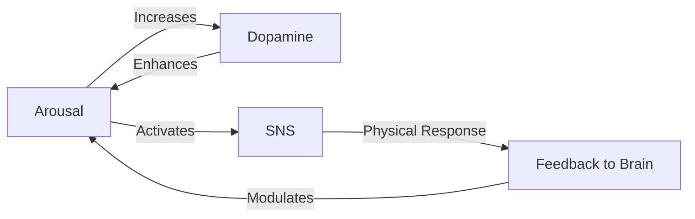
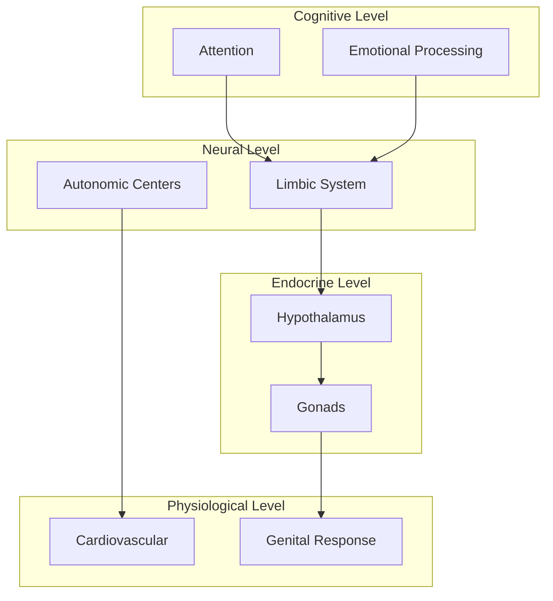

# Neuroscience Arousal Research - Improvement Roadmap

## 📊 Current State Analysis

**Existing Files:**
- `arousal_expanded.md` - Detailed Mermaid diagram with comprehensive pathways
- `arousal_mermaid.md` - Simplified conceptual flowchart

**Strengths:**
- Clear visual representation using Mermaid
- Good separation of concerns (hormones, neural pathways, physiological responses)
- Educational and accessible

**Opportunities for Enhancement:**
Multiple areas for expansion, rigor, and interactivity

---

## 🎯 Proposed Improvements

### 1. Documentation Enhancements

#### 1.1 Main README.md
- [ ] Create comprehensive README with:
  - Research overview and objectives
  - Scientific background and context
  - Usage instructions for diagrams
  - Contributing guidelines
  - References and citations
  - Glossary of terms

#### 1.2 Scientific Literature Review
- [ ] `literature_review.md` - Annotated bibliography of key papers
- [ ] `research_timeline.md` - Historical development of arousal neuroscience
- [ ] `competing_theories.md` - Different models and frameworks

#### 1.3 Expanded Documentation
- [ ] `detailed_mechanisms.md` - In-depth explanation of each pathway
- [ ] `sex_differences.md` - Gender/sex-specific arousal patterns
- [ ] `clinical_applications.md` - Therapeutic and medical relevance
- [ ] `comparative_neuroscience.md` - Cross-species comparisons

---

### 2. Advanced Visualizations

#### 2.1 Additional Mermaid Diagrams
- [ ] **Temporal sequence diagram** - Show arousal phases over time
- [ ] **State machine diagram** - Arousal states and transitions
- [ ] **Entity relationship diagram** - Hormones, neurotransmitters, brain regions
- [ ] **Gantt chart** - Timeline of physiological responses
- [ ] **Pie charts** - Relative contributions of different systems
- [ ] **Class diagram** - Object-oriented model of arousal components

#### 2.2 Interactive Visualizations
- [ ] D3.js interactive brain map
- [ ] Plotly neural network visualization
- [ ] 3D brain region activation viewer
- [ ] Timeline slider showing cascade effects
- [ ] Sankey diagram for information flow

#### 2.3 Alternative Diagram Types
```markdown
- [ ] Hierarchical tree structure
- [ ] Circular/radial layout for system interactions
- [ ] Layered architecture diagram (brain -> endocrine -> peripheral)
- [ ] Heat map of brain activity regions
- [ ] Network graph with weighted edges
```

---

### 3. Data & Research Components

#### 3.1 Datasets
- [ ] `data/neurotransmitter_levels.csv` - Concentration data
- [ ] `data/brain_activation_fmri.json` - fMRI study results
- [ ] `data/hormone_profiles.csv` - Hormonal variation data
- [ ] `data/time_course_data.csv` - Temporal dynamics

#### 3.2 Research Papers Database
- [ ] `papers/` directory with PDFs (if legally permissible)
- [ ] `papers/index.json` - Metadata and abstracts
- [ ] Citation network visualization

#### 3.3 Experimental Protocols
- [ ] `protocols/measurement_methods.md`
- [ ] `protocols/experimental_designs.md`
- [ ] `protocols/ethical_considerations.md`

---

### 4. Code & Scripts

#### 4.1 Python Implementations
```python
# Proposed scripts:
- [ ] arousal_model.py - Mathematical model of arousal dynamics
- [ ] visualize_pathways.py - Generate diagrams programmatically
- [ ] simulate_response.py - Simulate physiological cascade
- [ ] analyze_fmri.py - Process neuroimaging data
- [ ] hormone_dynamics.py - Model endocrine feedback loops
```

#### 4.2 Jupyter Notebooks
- [ ] `notebooks/arousal_exploration.ipynb` - Interactive walkthrough
- [ ] `notebooks/pathway_analysis.ipynb` - Analyze network topology
- [ ] `notebooks/data_visualization.ipynb` - Plot experimental data
- [ ] `notebooks/model_fitting.ipynb` - Fit models to empirical data

#### 4.3 Analysis Tools
- [ ] Network analysis (NetworkX)
- [ ] Time-series analysis
- [ ] Statistical modeling (scipy, statsmodels)
- [ ] Machine learning classification of arousal states

---

### 5. Badges & Metadata

#### 5.1 Status Badges
```markdown


```

#### 5.2 Academic Badges
```markdown


```

#### 5.3 Technical Badges
```markdown


```

#### 5.4 Quality Badges
```markdown


```

---

### 6. Structural Improvements

#### 6.1 Directory Organization
```
arousal/
├── README.md                      # Main overview
├── IMPROVEMENT_ROADMAP.md         # This file
├── diagrams/
│   ├── basic_flowchart.md
│   ├── detailed_pathways.md
│   ├── temporal_sequence.md
│   ├── brain_regions.md
│   └── interactive/
│       ├── d3_visualization.html
│       └── plotly_network.html
├── docs/
│   ├── literature_review.md
│   ├── mechanisms.md
│   ├── clinical_applications.md
│   └── glossary.md
├── data/
│   ├── neurotransmitters/
│   ├── hormones/
│   ├── fmri/
│   └── README.md
├── scripts/
│   ├── models/
│   ├── visualization/
│   ├── analysis/
│   └── requirements.txt
├── notebooks/
│   ├── exploration.ipynb
│   ├── analysis.ipynb
│   └── visualization.ipynb
├── papers/
│   ├── index.json
│   └── annotations/
├── tests/
│   └── test_models.py
└── assets/
    ├── images/
    └── videos/
```

---

### 7. Scientific Rigor Enhancements

#### 7.1 Quantitative Modeling
- [ ] Differential equation models of hormone dynamics
- [ ] Bayesian network of causal relationships
- [ ] Agent-based model of neural populations
- [ ] Compartmental models (brain regions as compartments)

#### 7.2 Validation & Verification
- [ ] Cross-reference with published literature
- [ ] Sensitivity analysis of model parameters
- [ ] Comparison with experimental data
- [ ] Uncertainty quantification

#### 7.3 Statistical Analysis
- [ ] Meta-analysis of published studies
- [ ] Effect size calculations
- [ ] Confidence intervals for relationships
- [ ] Power analysis for experiments

---

### 8. Interactive & Educational Features

#### 8.1 Learning Resources
- [ ] Interactive quiz/flashcards
- [ ] Annotated video explanations
- [ ] Step-by-step tutorial
- [ ] Case studies

#### 8.2 Simulation Tools
- [ ] Web-based interactive simulator
- [ ] Parameter adjustment sliders
- [ ] Real-time visualization updates
- [ ] Scenario comparison tool

#### 8.3 Gamification
- [ ] Learning pathways with milestones
- [ ] Knowledge check questions
- [ ] Progressive disclosure of complexity

---

### 9. Integration & APIs

#### 9.1 External Data Sources
- [ ] PubMed API integration for literature
- [ ] NeuroVault for neuroimaging data
- [ ] Allen Brain Atlas API
- [ ] OpenNeuro datasets

#### 9.2 Computational Tools
- [ ] BrainNet Viewer integration
- [ ] SPM/FSL neuroimaging pipelines
- [ ] NEURON simulation compatibility
- [ ] Brian2 spiking neural network models

---

### 10. Accessibility & Inclusivity

#### 10.1 Alternative Formats
- [ ] Text descriptions of all diagrams (alt text)
- [ ] Audio descriptions for visualizations
- [ ] High-contrast diagram versions
- [ ] Screen reader compatible HTML versions

#### 10.2 Multilingual Support
- [ ] Translation framework
- [ ] Key documents in multiple languages
- [ ] Internationalized terminology

#### 10.3 Diverse Perspectives
- [ ] Include diverse populations in research scope
- [ ] Cultural considerations in arousal research
- [ ] Acknowledge limitations and biases

---

### 11. Collaboration & Community

#### 11.1 Contribution Guidelines
- [ ] CONTRIBUTING.md with clear guidelines
- [ ] Code of conduct
- [ ] Issue templates
- [ ] Pull request templates

#### 11.2 Community Features
- [ ] Discussion forum/GitHub Discussions
- [ ] Expert review process
- [ ] Collaborative annotation platform
- [ ] Research partner network

---

### 12. CI/CD & Automation

#### 12.1 Automated Testing
- [ ] Diagram validation (Mermaid syntax)
- [ ] Link checking
- [ ] Citation format verification
- [ ] Code linting and testing

#### 12.2 Continuous Integration
```yaml
- [ ] GitHub Actions workflow
- [ ] Automated diagram generation
- [ ] Documentation building
- [ ] Notebook execution tests
```

#### 12.3 Automated Reporting
- [ ] Weekly progress reports
- [ ] Citation tracking
- [ ] Impact metrics dashboard

---

### 13. Advanced Features

#### 13.1 Machine Learning Applications
- [ ] Neural network trained on arousal patterns
- [ ] Classification of arousal states from physiological data
- [ ] Prediction of individual responses
- [ ] Anomaly detection in clinical populations

#### 13.2 Virtual Reality
- [ ] VR brain visualization
- [ ] Immersive educational experience
- [ ] 3D pathway exploration

#### 13.3 Augmented Reality
- [ ] AR overlay on anatomy models
- [ ] Mobile app for education

---

### 14. Documentation Quality

#### 14.1 Style & Formatting
- [ ] Consistent markdown formatting
- [ ] Professional technical writing
- [ ] Proper scientific notation
- [ ] Standardized terminology

#### 14.2 Cross-References
- [ ] Internal linking between documents
- [ ] Index of terms and concepts
- [ ] Related work sections
- [ ] Bibliography management (BibTeX)

---

## 🎨 Specific Visualization Ideas

### New Mermaid Diagrams to Create:

1. **Feedback Loops Diagram**


2. **Timeline Diagram**
```mermaid
gantt
    title Arousal Response Timeline
    section Neural
    Initial activation    :0, 0.5s
    Neural cascade       :0.5s, 2s
    section Hormonal
    Hormone release      :1s, 5s
    section Physiological
    Heart rate increase  :0.5s, 10s
    Vasodilation        :2s, 15s
```

3. **Multi-Level Architecture**


4. **Brain Region Heat Map** (ASCII representation)
```
Cortex     [██░░░░] 40%
Limbic     [████████] 95%
Brainstem  [██████░░] 75%
Cerebellum [██░░░░░░] 30%
```

---

## 📚 Citation & Reference Improvements

### Recommended Citation Format:
```bibtex
@article{key2025,
  title={Neural Mechanisms of Sexual Arousal},
  author={Last, First},
  journal={Journal Name},
  year={2025},
  volume={XX},
  pages={XXX-XXX},
  doi={10.xxxx/xxxxx}
}
```

### Key Papers to Reference:
- [ ] Georgiadis et al. on brain imaging during arousal
- [ ] Pfaus on neurobiology of sexual behavior
- [ ] Komisaruk & Whipple on genital stimulation pathways
- [ ] Toates on motivational systems
- [ ] Janssen & Bancroft on dual control model

---

## 🔬 Data Collection & Experiments

### Proposed Data Collection:
1. **Survey Data**: Self-reported arousal experiences
2. **Physiological Data**: Heart rate, skin conductance, temperature
3. **Neuroimaging**: fMRI, PET, EEG studies
4. **Hormonal Assays**: Blood/saliva samples
5. **Behavioral Metrics**: Reaction times, gaze tracking

### Experimental Designs:
- [ ] Within-subjects design
- [ ] Cross-sectional studies
- [ ] Longitudinal tracking
- [ ] Meta-analytic synthesis

---

## 🛠️ Technical Implementation Priorities

### Phase 1: Foundation (Weeks 1-2)
- [ ] Create README.md
- [ ] Reorganize directory structure
- [ ] Add initial badges
- [ ] Create glossary

### Phase 2: Content Expansion (Weeks 3-6)
- [ ] Literature review
- [ ] Additional Mermaid diagrams
- [ ] Detailed mechanism docs
- [ ] Data collection

### Phase 3: Code & Analysis (Weeks 7-10)
- [ ] Python models
- [ ] Jupyter notebooks
- [ ] Statistical analysis
- [ ] Visualization scripts

### Phase 4: Advanced Features (Weeks 11-14)
- [ ] Interactive visualizations
- [ ] Machine learning models
- [ ] API integrations
- [ ] CI/CD setup

### Phase 5: Polish & Release (Weeks 15-16)
- [ ] Documentation review
- [ ] Accessibility audit
- [ ] Community launch
- [ ] Publication preparation

---

## 📊 Success Metrics

### Quantitative:
- Number of diagrams: Target 15+
- Code coverage: Target 80%+
- Documentation completeness: Target 95%+
- Citations referenced: Target 50+

### Qualitative:
- Scientific accuracy (peer review)
- Educational value (user feedback)
- Code quality (maintainability)
- Community engagement

---

## 🤝 Collaboration Opportunities

### Potential Collaborators:
- Neuroscience researchers
- Clinical psychologists
- Data visualization experts
- Medical illustrators
- Education specialists

### Platforms for Sharing:
- GitHub Pages for documentation
- Jupyter Book for interactive content
- ResearchGate for academic visibility
- Medium/blog for public outreach

---

## 📝 License & Ethics Considerations

### Recommended Licenses:
- **Code**: MIT or Apache 2.0
- **Documentation**: CC BY 4.0
- **Data**: CC0 or CC BY 4.0

### Ethical Guidelines:
- [ ] IRB approval for human subjects data
- [ ] Informed consent procedures
- [ ] Privacy protection measures
- [ ] Sensitive content warnings
- [ ] Inclusive language review

---

## 🎯 Quick Wins (Start Here)

### Easy Implementations:
1. Add README.md with badges (1 hour)
2. Create glossary of terms (2 hours)
3. Add 3 more Mermaid diagrams (3 hours)
4. Organize into subdirectories (1 hour)
5. Write literature review intro (2 hours)

### Medium Effort:
1. Create first Jupyter notebook (1 day)
2. Build interactive D3 visualization (2 days)
3. Implement basic Python model (2 days)
4. Set up CI/CD pipeline (1 day)

### Long-term Projects:
1. Comprehensive literature database (2 weeks)
2. Full statistical analysis suite (3 weeks)
3. Machine learning classification (4 weeks)
4. VR/AR implementation (6 weeks)

---

## 📖 Resources & Tools

### Visualization:
- Mermaid.js (current)
- D3.js (interactive web)
- Plotly (Python)
- Matplotlib/Seaborn (static)
- Graphviz (network graphs)

### Scientific Computing:
- NumPy/SciPy (numerical)
- Pandas (data manipulation)
- Statsmodels (statistics)
- NetworkX (graph theory)
- Brian2 (neural simulation)

### Documentation:
- Jupyter Book
- Sphinx
- MkDocs
- Docusaurus

### Data Sources:
- PubMed Central
- OpenNeuro
- NeuroVault
- Allen Brain Atlas
- Human Connectome Project

---

## 🌟 Innovative Ideas

### Cutting-Edge Additions:
1. **LLM Integration**: Use GPT models to explain pathways in natural language
2. **Generative Art**: Create artistic representations of neural networks
3. **Sonification**: Convert neural activity patterns to sound
4. **Real-time Biofeedback**: Connect to wearable devices
5. **Blockchain**: Timestamp research findings for provenance
6. **Federated Learning**: Privacy-preserving multi-site analysis

---

## 📞 Contact & Contribution

To contribute to this roadmap:
1. Open an issue to discuss major changes
2. Submit a PR for specific implementations
3. Join discussions in GitHub Discussions
4. Contact maintainers for collaboration

---

**Last Updated**: 2025-11-19
**Version**: 1.0
**Status**: Draft - Seeking Feedback
