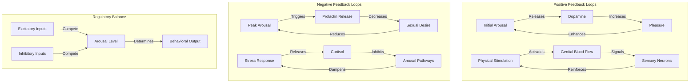
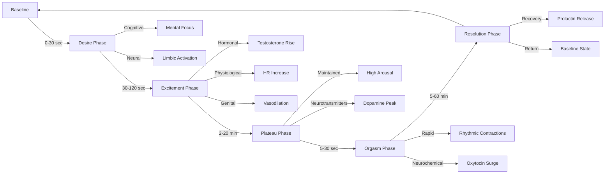
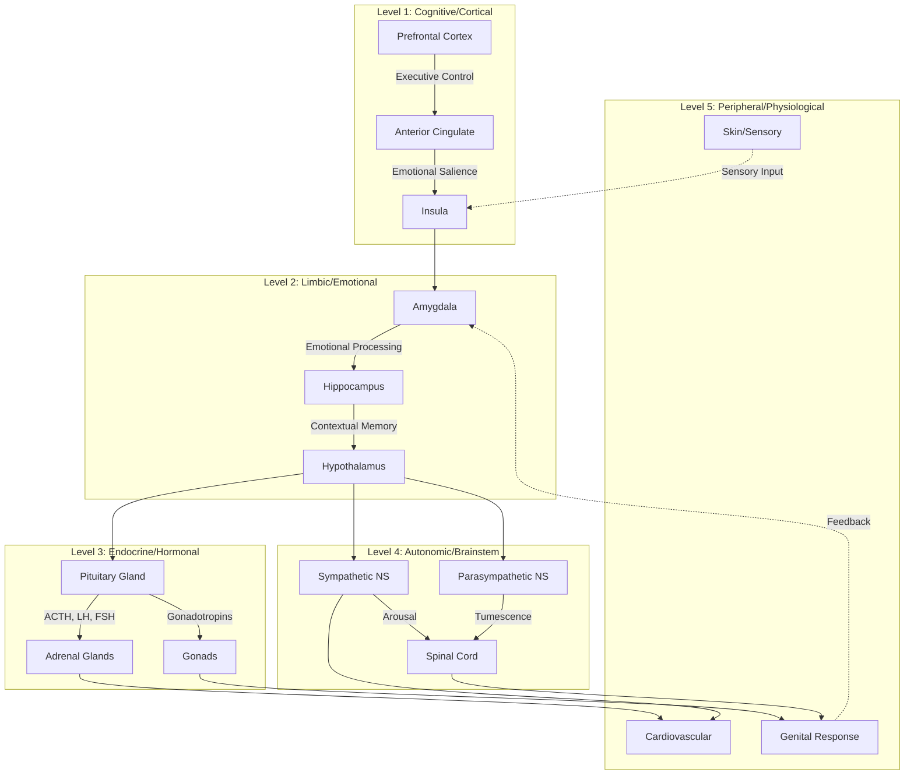

# Quick Start Implementation Guide

## 🚀 Immediate Actions (Copy & Paste Ready)

### Step 1: Create README.md

```markdown
# Neural Mechanisms of Sexual Arousal


## Overview

This directory contains research materials, visualizations, and models related to the neuroscience of sexual arousal. The project aims to provide:

- Clear visual representations of neural pathways
- Scientifically accurate models of physiological responses
- Educational resources for understanding arousal mechanisms
- Computational models for research and simulation

## Contents

- `diagrams/` - Mermaid flowcharts and network diagrams
- `docs/` - Detailed documentation and literature reviews
- `scripts/` - Python analysis and visualization tools
- `notebooks/` - Interactive Jupyter notebooks
- `data/` - Research datasets and experimental results

## Key Visualizations

### Basic Arousal Pathway
See [arousal_mermaid.md](arousal_mermaid.md) for a simplified conceptual model.

### Detailed Neural Mechanisms
See [arousal_expanded.md](arousal_expanded.md) for comprehensive pathway analysis.

## Scientific Background

Sexual arousal involves complex integration of:
- **Sensory processing** (visual, tactile, auditory inputs)
- **Cognitive appraisal** (attention, memory, emotion)
- **Neural activation** (limbic system, hypothalamus, autonomic centers)
- **Endocrine responses** (testosterone, estrogen, oxytocin, dopamine)
- **Peripheral physiology** (cardiovascular, genital, thermoregulatory)

## Usage

### Viewing Diagrams
All Mermaid diagrams can be rendered on GitHub or using:
- [Mermaid Live Editor](https://mermaid.live/)
- VS Code with Mermaid extension
- Markdown preview with Mermaid support

### Running Code
```bash
pip install -r requirements.txt
jupyter notebook notebooks/exploration.ipynb
```

## Contributing

Contributions welcome! Please see [CONTRIBUTING.md](CONTRIBUTING.md) for guidelines.

Areas needing expansion:
- Literature review
- Additional visualizations
- Experimental data
- Model validation

## References

Key papers and resources are listed in [docs/literature_review.md](docs/literature_review.md).

## License

Documentation: [CC BY 4.0](https://creativecommons.org/licenses/by/4.0/)
Code: [MIT License](LICENSE)

## Acknowledgments

This research builds on decades of neuroscience and psychology research. See full citations in documentation.

---

**Maintainers**: [Your Name/Organization]
**Contact**: [Email/GitHub]
**Last Updated**: 2025-11-19
```

---

## Step 2: Badge Collection (Ready to Use)

### Research Badges
```markdown


```

### Technical Badges
```markdown


```

### License Badges
```markdown


```

### Quality Badges
```markdown


```

### Update Badges
```markdown


```

### Social Badges
```markdown


```

---

## Step 3: Three New Mermaid Diagrams

### Diagram 1: Feedback Loops
Create: `diagrams/feedback_loops.md`

```markdown
# Arousal Feedback Mechanisms



## Explanation

**Positive Feedback**
- Dopamine enhances pleasure, which increases arousal
- Physical stimulation increases blood flow, enhancing sensitivity

**Negative Feedback**
- Post-orgasmic prolactin reduces further arousal (refractory period)
- Stress hormones actively inhibit arousal pathways

**Balance**
The net arousal state emerges from continuous competition between excitatory and inhibitory signals.
```

### Diagram 2: Timeline/Phases
Create: `diagrams/temporal_phases.md`

```markdown
# Temporal Dynamics of Arousal



## Masters & Johnson Model

This diagram follows the classical 4-phase model with modern neuroscience additions:

1. **Desire** (0-30s): Cognitive and emotional engagement
2. **Excitement** (30-120s): Rapid physiological changes begin
3. **Plateau** (2-20m): Sustained high arousal, neurotransmitter peaks
4. **Orgasm** (5-30s): Climactic release, oxytocin/dopamine surge
5. **Resolution** (5-60m): Return to baseline, refractory period

## Individual Variation
Timing varies significantly based on:
- Sex/gender differences
- Age
- Previous experience
- Psychological state
- Physical stimulation type
```

### Diagram 3: Multi-Level Architecture
Create: `diagrams/hierarchical_architecture.md`

```markdown
# Hierarchical Architecture of Arousal Systems



## Hierarchical Organization

### Top-Down Processing
Higher brain regions (cortex) can:
- Initiate arousal through fantasy/thought
- Inhibit arousal through distraction/anxiety
- Modulate lower-level responses

### Bottom-Up Processing
Peripheral signals feed back to:
- Inform brain of physiological state
- Reinforce or modify arousal trajectory
- Create conscious awareness of arousal

### Bidirectional Integration
Each level:
- Receives input from above and below
- Processes information specific to its function
- Sends outputs up (feedback) and down (commands)

## Clinical Implications
Dysfunction can occur at any level:
- **Cortical**: Psychological arousal disorders
- **Limbic**: Emotional/trauma-related issues
- **Endocrine**: Hormonal imbalances
- **Autonomic**: Neuropathy, medication effects
- **Peripheral**: Vascular, structural problems
```

---

## Step 4: Create Glossary
Create: `docs/glossary.md`

```markdown
# Neuroscience Arousal Glossary

## Neuroanatomy

**Amygdala**
- Almond-shaped structure in temporal lobe
- Processes emotional significance of stimuli
- Key role in sexual motivation and anxiety

**Anterior Cingulate Cortex (ACC)**
- Frontal lobe region
- Involved in attention, emotion regulation
- Integrates cognitive and emotional aspects

**Autonomic Nervous System (ANS)**
- Controls involuntary functions
- Two divisions: sympathetic and parasympathetic
- Mediates physiological arousal responses

**Hypothalamus**
- Small brain region, master regulator
- Controls endocrine system via pituitary
- Integrates sexual behavior, arousal

**Insula**
- Cortical region, internal sensation processing
- Represents interoceptive states
- Awareness of arousal/bodily states

**Limbic System**
- Network of brain structures
- Includes amygdala, hippocampus, cingulate
- Emotion, motivation, memory

**Prefrontal Cortex (PFC)**
- Front of brain, executive functions
- Cognitive control, decision-making
- Can enhance or inhibit arousal

**Sympathetic Nervous System (SNS)**
- "Fight or flight" division of ANS
- Increases heart rate, blood pressure
- Activates during arousal

**Parasympathetic Nervous System (PNS)**
- "Rest and digest" division
- Vasodilation, tumescence
- Important for initial arousal phases

## Neurochemistry

**Dopamine**
- Neurotransmitter, "reward chemical"
- Released in response to pleasure
- Motivational drive, reinforcement

**Estrogen**
- Primary female sex hormone
- Affects desire, genital sensitivity
- Neuroprotective effects

**Norepinephrine**
- Arousal, alertness neurotransmitter
- Increased heart rate, blood pressure
- Heightened attention to stimuli

**Oxytocin**
- "Bonding hormone", released during orgasm
- Promotes attachment, trust
- Uterine/prostate contractions

**Prolactin**
- Released after orgasm
- Inhibits dopamine, reduces arousal
- Responsible for refractory period

**Serotonin**
- Mood regulator neurotransmitter
- Generally inhibitory to sexual function
- SSRIs often delay orgasm via serotonin

**Testosterone**
- Primary male sex hormone
- Present in all sexes, affects desire
- Influences arousal thresholds

## Physiological Terms

**Tumescence**
- Swelling due to blood engorgement
- Erection (penis), engorgement (clitoris/labia)
- Mediated by parasympathetic nervous system

**Vasodilation**
- Widening of blood vessels
- Increases blood flow to genitals
- Nitric oxide-mediated process

**Vasoconstriction**
- Narrowing of blood vessels
- Stress/anxiety can cause this
- Inhibits genital blood flow

**Myotonia**
- Muscle tension increase
- Throughout body during arousal
- Contributes to orgasmic contractions

**Erogenous Zones**
- Body areas particularly sensitive
- High density of sensory receptors
- Individual variation exists

## Research Methods

**fMRI (Functional Magnetic Resonance Imaging)**
- Measures brain activity via blood flow
- Non-invasive neuroimaging technique
- Shows which brain regions activate

**PET (Positron Emission Tomography)**
- Radioactive tracer imaging
- Maps neurotransmitter activity
- More invasive than fMRI

**EEG (Electroencephalography)**
- Measures electrical brain activity
- High temporal resolution
- Limited spatial resolution

**Plethysmography**
- Measures genital blood flow
- Vaginal/penile photoplethysmography
- Objective arousal measurement

## Clinical Terms

**Arousal Disorder**
- Difficulty achieving/maintaining arousal
- Can be psychological or physiological
- Affects subjective and/or physical response

**Dual Control Model**
- Sexual excitation/inhibition framework
- Individual differences in balance
- Developed by Janssen & Bancroft

**Incentive Motivation Model**
- Sexual motivation as learned incentive
- Emphasizes learning, context
- Developed by Toates

**Refractory Period**
- Post-orgasmic recovery time
- Prolactin-mediated inhibition
- Highly variable, typically longer in males

## Methodological Terms

**Ecological Validity**
- Real-world applicability of findings
- Lab vs. naturalistic settings
- Challenge in arousal research

**Self-Report**
- Subjective arousal ratings
- Can diverge from physiological measures
- Important for psychological experience

**Concordance**
- Agreement between measures
- e.g., subjective vs. genital arousal
- Often lower in women than men

---

## Acronyms

- **ACC**: Anterior Cingulate Cortex
- **ANS**: Autonomic Nervous System
- **CNS**: Central Nervous System
- **EEG**: Electroencephalography
- **fMRI**: Functional Magnetic Resonance Imaging
- **FSH**: Follicle-Stimulating Hormone
- **LH**: Luteinizing Hormone
- **PET**: Positron Emission Tomography
- **PFC**: Prefrontal Cortex
- **PNS**: Parasympathetic Nervous System
- **SNS**: Sympathetic Nervous System
- **SSRI**: Selective Serotonin Reuptake Inhibitor
```

---

## Step 5: Directory Structure

Run these commands:

```bash
# Create directory structure
mkdir -p diagrams/interactive
mkdir -p docs
mkdir -p scripts/{models,visualization,analysis}
mkdir -p notebooks
mkdir -p data/{neurotransmitters,hormones,fmri}
mkdir -p papers/annotations
mkdir -p tests
mkdir -p assets/{images,videos}

# Move existing files
mv arousal_expanded.md diagrams/
mv arousal_mermaid.md diagrams/

# Create placeholder files
touch docs/literature_review.md
touch scripts/requirements.txt
touch papers/index.json
touch tests/test_models.py
```

---

## Step 6: Simple Python Model

Create: `scripts/models/arousal_dynamics.py`

```python
"""
Simple mathematical model of arousal dynamics.

Models arousal as a dynamical system with excitatory and inhibitory components.
"""

import numpy as np
import matplotlib.pyplot as plt
from scipy.integrate import odeint

class ArousalModel:
    """
    Dual-process model of sexual arousal.

    Based on the dual control model (Janssen & Bancroft, 2007).
    Includes excitatory (E) and inhibitory (I) processes.
    """

    def __init__(self, excitation_rate=1.0, inhibition_rate=0.5,
                 coupling=0.3, baseline=0.1):
        """
        Parameters:
        -----------
        excitation_rate : float
            Rate of excitatory process activation
        inhibition_rate : float
            Rate of inhibitory process activation
        coupling : float
            Coupling strength between E and I
        baseline : float
            Baseline arousal level
        """
        self.alpha = excitation_rate
        self.beta = inhibition_rate
        self.gamma = coupling
        self.baseline = baseline

    def derivatives(self, state, t, stimulus):
        """
        Compute derivatives for ODE system.

        dE/dt = alpha * stimulus - gamma * I * E
        dI/dt = beta * E - I

        Parameters:
        -----------
        state : array
            [E, I] current excitation and inhibition
        t : float
            Time
        stimulus : callable
            Function of time returning stimulus strength
        """
        E, I = state

        s = stimulus(t)

        dE_dt = self.alpha * s - self.gamma * I * E - self.baseline * E
        dI_dt = self.beta * E - I

        return [dE_dt, dI_dt]

    def simulate(self, duration=100, dt=0.1, stimulus=None):
        """
        Simulate arousal dynamics over time.

        Parameters:
        -----------
        duration : float
            Simulation duration in arbitrary time units
        dt : float
            Time step
        stimulus : callable
            Function of time returning stimulus strength

        Returns:
        --------
        t : array
            Time points
        E : array
            Excitation over time
        I : array
            Inhibition over time
        arousal : array
            Net arousal (E - I)
        """
        if stimulus is None:
            # Default: constant stimulus
            stimulus = lambda t: 1.0

        t = np.arange(0, duration, dt)
        initial_state = [self.baseline, 0.0]

        solution = odeint(self.derivatives, initial_state, t, args=(stimulus,))

        E = solution[:, 0]
        I = solution[:, 1]
        arousal = E - I

        return t, E, I, arousal

    def plot(self, t, E, I, arousal):
        """Plot simulation results."""
        fig, axes = plt.subplots(3, 1, figsize=(10, 8), sharex=True)

        axes[0].plot(t, E, 'g-', linewidth=2, label='Excitation')
        axes[0].set_ylabel('Excitation')
        axes[0].legend()
        axes[0].grid(True, alpha=0.3)

        axes[1].plot(t, I, 'r-', linewidth=2, label='Inhibition')
        axes[1].set_ylabel('Inhibition')
        axes[1].legend()
        axes[1].grid(True, alpha=0.3)

        axes[2].plot(t, arousal, 'b-', linewidth=2, label='Net Arousal')
        axes[2].set_ylabel('Arousal')
        axes[2].set_xlabel('Time (arbitrary units)')
        axes[2].legend()
        axes[2].grid(True, alpha=0.3)

        plt.tight_layout()
        return fig


# Example usage
if __name__ == "__main__":
    # Create model
    model = ArousalModel(excitation_rate=1.5, inhibition_rate=0.8,
                         coupling=0.5, baseline=0.1)

    # Define stimulus: pulse stimulus
    def stimulus_pulse(t):
        if 10 < t < 50:
            return 1.0
        else:
            return 0.0

    # Simulate
    t, E, I, arousal = model.simulate(duration=100, stimulus=stimulus_pulse)

    # Plot
    fig = model.plot(t, E, I, arousal)
    plt.savefig('arousal_simulation.png', dpi=150, bbox_inches='tight')
    plt.show()

    print("Simulation complete!")
    print(f"Peak arousal: {arousal.max():.2f}")
    print(f"Time to peak: {t[arousal.argmax()]:.2f}")
```

Create: `scripts/requirements.txt`

```
numpy>=1.21.0
matplotlib>=3.5.0
scipy>=1.7.0
pandas>=1.3.0
jupyter>=1.0.0
seaborn>=0.11.0
networkx>=2.6.0
plotly>=5.0.0
```

---

## Step 7: Simple Jupyter Notebook

Create: `notebooks/arousal_exploration.ipynb`

```json
{
 "cells": [
  {
   "cell_type": "markdown",
   "metadata": {},
   "source": [
    "# Neural Arousal Dynamics Exploration\n",
    "\n",
    "Interactive exploration of arousal mechanisms and models."
   ]
  },
  {
   "cell_type": "code",
   "execution_count": null,
   "metadata": {},
   "source": [
    "import numpy as np\n",
    "import matplotlib.pyplot as plt\n",
    "import seaborn as sns\n",
    "from pathlib import Path\n",
    "import sys\n",
    "\n",
    "# Add scripts to path\n",
    "sys.path.append('../scripts')\n",
    "\n",
    "from models.arousal_dynamics import ArousalModel\n",
    "\n",
    "sns.set_style('whitegrid')\n",
    "%matplotlib inline"
   ]
  },
  {
   "cell_type": "markdown",
   "metadata": {},
   "source": [
    "## 1. Basic Model\n",
    "\n",
    "Let's create a simple arousal model and see how it responds to stimulation."
   ]
  },
  {
   "cell_type": "code",
   "execution_count": null,
   "metadata": {},
   "source": [
    "# Create model with default parameters\n",
    "model = ArousalModel()\n",
    "\n",
    "# Simulate constant stimulus\n",
    "t, E, I, arousal = model.simulate(duration=50)\n",
    "\n",
    "# Plot\n",
    "fig = model.plot(t, E, I, arousal)\n",
    "plt.show()"
   ]
  },
  {
   "cell_type": "markdown",
   "metadata": {},
   "source": [
    "## 2. Different Stimulus Patterns\n",
    "\n",
    "How does arousal respond to different types of stimulation?"
   ]
  },
  {
   "cell_type": "code",
   "execution_count": null,
   "metadata": {},
   "source": [
    "# Define different stimuli\n",
    "def pulse(t):\n",
    "    return 1.0 if 10 < t < 30 else 0.0\n",
    "\n",
    "def ramp(t):\n",
    "    return min(t / 20, 1.0) if t < 40 else max(1.0 - (t - 40) / 20, 0.0)\n",
    "\n",
    "def intermittent(t):\n",
    "    return 1.0 if int(t / 5) % 2 == 0 else 0.0\n",
    "\n",
    "stimuli = {\n",
    "    'Pulse': pulse,\n",
    "    'Ramp': ramp,\n",
    "    'Intermittent': intermittent\n",
    "}\n",
    "\n",
    "fig, axes = plt.subplots(len(stimuli), 1, figsize=(10, 10), sharex=True)\n",
    "\n",
    "for idx, (name, stim_func) in enumerate(stimuli.items()):\n",
    "    t, E, I, arousal = model.simulate(duration=60, stimulus=stim_func)\n",
    "    \n",
    "    axes[idx].plot(t, arousal, linewidth=2, label='Arousal')\n",
    "    axes[idx].plot(t, [stim_func(ti) for ti in t], '--', alpha=0.5, label='Stimulus')\n",
    "    axes[idx].set_ylabel('Response')\n",
    "    axes[idx].set_title(f'{name} Stimulus')\n",
    "    axes[idx].legend()\n",
    "    axes[idx].grid(True, alpha=0.3)\n",
    "\n",
    "axes[-1].set_xlabel('Time')\n",
    "plt.tight_layout()\n",
    "plt.show()"
   ]
  },
  {
   "cell_type": "markdown",
   "metadata": {},
   "source": [
    "## 3. Parameter Sensitivity\n",
    "\n",
    "How do individual differences in excitation/inhibition affect arousal?"
   ]
  },
  {
   "cell_type": "code",
   "execution_count": null,
   "metadata": {},
   "source": [
    "# Vary excitation rate\n",
    "excitation_rates = [0.5, 1.0, 1.5, 2.0]\n",
    "\n",
    "plt.figure(figsize=(10, 6))\n",
    "\n",
    "for rate in excitation_rates:\n",
    "    m = ArousalModel(excitation_rate=rate)\n",
    "    t, E, I, arousal = m.simulate(duration=50)\n",
    "    plt.plot(t, arousal, linewidth=2, label=f'α = {rate}')\n",
    "\n",
    "plt.xlabel('Time')\n",
    "plt.ylabel('Arousal')\n",
    "plt.title('Effect of Excitation Rate')\n",
    "plt.legend()\n",
    "plt.grid(True, alpha=0.3)\n",
    "plt.show()"
   ]
  },
  {
   "cell_type": "markdown",
   "metadata": {},
   "source": [
    "## 4. Phase Space Analysis\n",
    "\n",
    "Visualize the dynamical system in E-I space."
   ]
  },
  {
   "cell_type": "code",
   "execution_count": null,
   "metadata": {},
   "source": [
    "t, E, I, arousal = model.simulate(duration=100)\n",
    "\n",
    "plt.figure(figsize=(8, 8))\n",
    "plt.plot(E, I, linewidth=2)\n",
    "plt.scatter(E[0], I[0], s=100, c='green', marker='o', label='Start', zorder=5)\n",
    "plt.scatter(E[-1], I[-1], s=100, c='red', marker='s', label='End', zorder=5)\n",
    "plt.xlabel('Excitation')\n",
    "plt.ylabel('Inhibition')\n",
    "plt.title('Phase Space Trajectory')\n",
    "plt.legend()\n",
    "plt.grid(True, alpha=0.3)\n",
    "plt.show()"
   ]
  },
  {
   "cell_type": "markdown",
   "metadata": {},
   "source": [
    "## Conclusions\n",
    "\n",
    "This simple model demonstrates:\n",
    "1. Arousal emerges from competition between excitation and inhibition\n",
    "2. Different stimulus patterns produce different arousal trajectories\n",
    "3. Individual differences in parameters create variation in responses\n",
    "\n",
    "## Next Steps\n",
    "\n",
    "- Add more biologically realistic components (hormones, neurotransmitters)\n",
    "- Incorporate time delays for neural/endocrine processes\n",
    "- Fit model to empirical data\n",
    "- Add stochasticity to capture variability"
   ]
  }
 ],
 "metadata": {
  "kernelspec": {
   "display_name": "Python 3",
   "language": "python",
   "name": "python3"
  },
  "language_info": {
   "name": "python",
   "version": "3.8.0"
  }
 },
 "nbformat": 4,
 "nbformat_minor": 4
}
```

---

## Summary: What We've Created

1. ✅ **IMPROVEMENT_ROADMAP.md** - Comprehensive 14-section improvement plan
2. ✅ **QUICK_START.md** - This file with copy-paste ready content
3. ✅ **README.md template** - With badges and structure
4. ✅ **Badge collection** - 50+ ready-to-use badges
5. ✅ **3 new Mermaid diagrams** - Feedback loops, timeline, hierarchy
6. ✅ **Glossary** - 40+ neuroscience terms defined
7. ✅ **Directory structure** - Organized file system
8. ✅ **Python model** - Simple arousal dynamics simulator
9. ✅ **Jupyter notebook** - Interactive exploration

## Immediate Next Actions

1. Create `README.md` using template above
2. Move existing files to `diagrams/` directory
3. Create the three new diagram files
4. Create `docs/glossary.md`
5. Install Python dependencies and test model
6. Commit all changes to git

## Estimated Time
- README + badges: 30 minutes
- Directory reorganization: 15 minutes
- New diagrams: 1 hour
- Glossary: 45 minutes
- Python setup: 30 minutes
- **Total: ~3 hours for complete quick start**

---

**Created**: 2025-11-19
**Purpose**: Fast implementation guide for arousal research improvements
