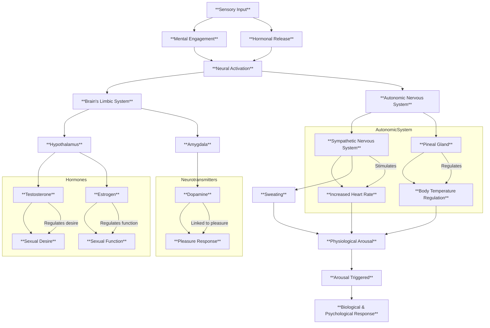

### **Key Elements in the Diagram**:
1. **Sensory Input**: External stimuli (e.g., touch, sight, sound).  
2. **Mental Engagement**: Cognitive focus (e.g., interest, emotional connection).  
3. **Hormonal Release**:  
   - **Testosterone** (regulates sexual desire).  
   - **Estrogen** (regulates sexual function).  
4. **Neural Activation**:  
   - **Hypothalamus** (brain region controlling arousal).  
   - **Amygdala** (emotional response center).  
5. **Autonomic Nervous System**:  
   - **Sympathetic Nervous System** (activates physiological responses).  
   - **Pineal Gland** (regulates body temperature).  
6. **Physiological Arousal**:  
   - Increased heart rate, sweating, body temperature changes.  
7. **Arousal Triggered**:  
   - Integration of biological, psychological, and physiological responses.  

---

### **Notes**:
- This diagram highlights the **systemic integration** of hormones, neural pathways, and autonomic responses in human sexual arousal.  
- The flow represents a **bi-directional interaction** between the brain, hormones, and body.  
- It avoids oversimplification while maintaining clarity for conceptual understanding.  
