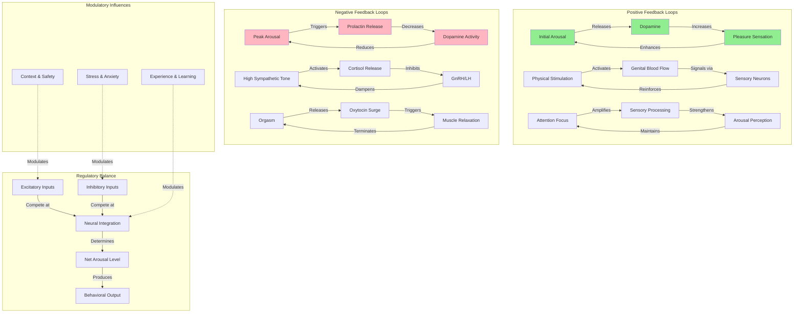

# Arousal Feedback Mechanisms

This diagram illustrates the positive and negative feedback loops that regulate sexual arousal intensity, duration, and termination.



## Explanation

### Positive Feedback Loops (Green)

These loops amplify arousal once initiated:

#### 1. Dopamine-Pleasure Loop
- **Initial arousal** triggers dopamine release in nucleus accumbens
- **Dopamine** creates subjective pleasure and motivation
- **Pleasure sensation** reinforces arousal, creating more dopamine
- **Result**: Progressive intensification of arousal

#### 2. Genital-Sensory Loop
- **Physical stimulation** (tactile, pressure) increases genital blood flow
- **Blood flow** enhances sensitivity and tumescence
- **Sensory neurons** relay heightened signals to spinal cord and brain
- **Spinal reflexes** further enhance stimulation response
- **Result**: Self-amplifying genital arousal

#### 3. Attention-Perception Loop
- **Focused attention** on sexual stimuli enhances neural processing
- **Enhanced processing** increases salience and arousal perception
- **Perceived arousal** captures more attention
- **Result**: Cognitive amplification of arousal

### Negative Feedback Loops (Pink)

These loops limit arousal and enable termination:

#### 1. Prolactin-Dopamine Loop
- **Peak arousal/orgasm** stimulates prolactin release from pituitary
- **Prolactin** inhibits dopamine neurons in ventral tegmental area
- **Reduced dopamine** decreases motivation and pleasure
- **Result**: Refractory period, reduced sexual desire post-orgasm
- **Time course**: Prolactin remains elevated 30-120 minutes

#### 2. Stress Hormone Loop
- **Sustained high sympathetic activation** can trigger HPA axis
- **Cortisol release** inhibits GnRH (gonadotropin-releasing hormone)
- **Reduced GnRH/LH** lowers testosterone/estrogen signaling
- **Result**: Chronic stress inhibits arousal capacity
- **Clinical relevance**: Stress-related sexual dysfunction

#### 3. Orgasm-Resolution Loop
- **Orgasm** triggers massive oxytocin release
- **Oxytocin** causes rhythmic smooth muscle contractions
- **Post-orgasmic relaxation** mediated by endorphins and ANS shift
- **Result**: Physiological resolution, return to baseline

### Regulatory Balance (Blue)

The net arousal state emerges from continuous competition:

#### Excitatory Inputs
- Sexual stimuli (visual, tactile, auditory, olfactory)
- Dopaminergic signaling
- Sympathetic nervous system activation
- Testosterone/estrogen priming
- Positive context cues

#### Inhibitory Inputs
- Anxiety and fear
- Distraction and cognitive load
- Serotonergic tone (SSRIs increase this)
- Prolactin
- Negative context cues
- Pain or discomfort

#### Neural Integration
- **Hypothalamus**: Integrates hormonal and neural signals
- **Amygdala**: Weighs emotional valence and threat
- **Prefrontal cortex**: Applies cognitive control
- **Spinal integration**: Coordinates reflexes

### Modulatory Influences (Dotted Lines)

These factors adjust the gain of feedback systems:

- **Context & Safety**: Safe, private, familiar contexts enhance excitatory loops
- **Stress & Anxiety**: Chronic stress strengthens inhibitory pathways
- **Experience & Learning**: Sexual experience tunes sensitivity and response patterns

## Clinical Implications

### Arousal Disorders
Dysfunction in feedback regulation can cause:

**Hypoactive Sexual Desire Disorder (HSDD)**
- Weak positive feedback (low dopamine sensitivity)
- Strong negative feedback (high prolactin, high serotonin)
- Treatment: Address inhibitory factors, dopamine agonists

**Sexual Arousal Disorder**
- Insufficient genital feedback loop
- Vascular or neurological issues
- Treatment: PDE5 inhibitors (enhance vasodilation), hormone therapy

**Hypersexuality**
- Excessive positive feedback
- Weak negative feedback (prolactin insensitivity)
- May involve dopamine dysregulation

### Pharmacological Targets

**Enhancing Arousal**
- PDE5 inhibitors (sildenafil): Enhance genital blood flow loop
- Dopamine agonists: Strengthen pleasure feedback
- Testosterone therapy: Increase baseline excitability

**Inhibiting Arousal**
- SSRIs: Increase serotonin (strengthens inhibition)
- Dopamine antagonists: Reduce pleasure feedback
- Anti-androgens: Reduce excitatory drive

## Mathematical Representation

This feedback system can be modeled as coupled differential equations:

```
dA/dt = α·S - β·I·A + γ·A²/(1+A²) - δ·A
dI/dt = ε·A - ζ·I

Where:
A = Arousal level
I = Inhibition level
S = Stimulus strength
α = Excitatory gain
β = Inhibitory strength
γ = Positive feedback strength
δ = Decay rate
ε = Inhibition buildup rate
ζ = Inhibition decay rate
```

The γ·A²/(1+A²) term represents positive feedback that saturates at high arousal, preventing infinite amplification.

## Research Methods

Studying feedback loops requires:

### Neuroimaging
- **fMRI**: Identify activated brain regions over time
- **PET**: Map neurotransmitter release dynamics
- **EEG**: Track temporal dynamics of arousal waves

### Endocrine Assays
- **Blood samples**: Measure hormone time-courses
- **Saliva samples**: Non-invasive repeated measures
- **Microdialysis**: Real-time neurotransmitter levels (animal models)

### Psychophysiology
- **Genital plethysmography**: Objective arousal measurement
- **Heart rate variability**: Autonomic balance
- **Pupillometry**: Sympathetic activation

### Computational Modeling
- **Dynamical systems**: Predict arousal trajectories
- **Parameter fitting**: Estimate individual differences
- **Perturbation analysis**: Test intervention effects

## Key References

- **Krüger, T. H., et al. (2002)**. "Specificity of the neuroendocrine response to orgasm during sexual arousal in men." *Journal of Endocrinology*, 177(1), 57-64.
  - Documented prolactin surge and refractory period

- **Melis, M. R., & Argiolas, A. (2011)**. "Central control of penile erection: a re-visitation of the role of oxytocin and its interaction with dopamine and glutamic acid in male rats." *Neuroscience & Biobehavioral Reviews*, 35(3), 939-955.
  - Oxytocin-dopamine interactions

- **Pfaus, J. G. (2009)**. "Pathways of sexual desire." *Journal of Sexual Medicine*, 6(6), 1506-1533.
  - Comprehensive review of incentive motivation and feedback

- **Both, S., et al. (2008)**. "Autonomic and subjective sexual responses in women: Do they show concordance?" *Psychophysiology*, 45(1), 11-19.
  - Feedback loop concordance and individual differences

## Individual Variation

People differ in:
- **Positive feedback strength**: How quickly arousal self-amplifies
- **Negative feedback sensitivity**: Refractory period duration
- **Baseline set-point**: Starting arousal level
- **Threshold for orgasm**: Integration time needed
- **Recovery rate**: How fast inhibition decays

These variations are influenced by:
- Genetics (dopamine receptor polymorphisms)
- Hormonal status (menstrual cycle, age, medications)
- Neural sensitization (sexual experience)
- Psychological factors (stress, mood, relationship quality)

## Future Research Directions

1. **Single-cell recording** during sexual behavior (animal models)
2. **Optogenetics** to causally test feedback circuits
3. **Real-time neurofeedback** to modulate arousal
4. **Computational psychiatry** models of sexual dysfunction
5. **Precision medicine** based on individual feedback parameters

---

**Last Updated**: 2025-11-19
**Status**: Research in Progress
