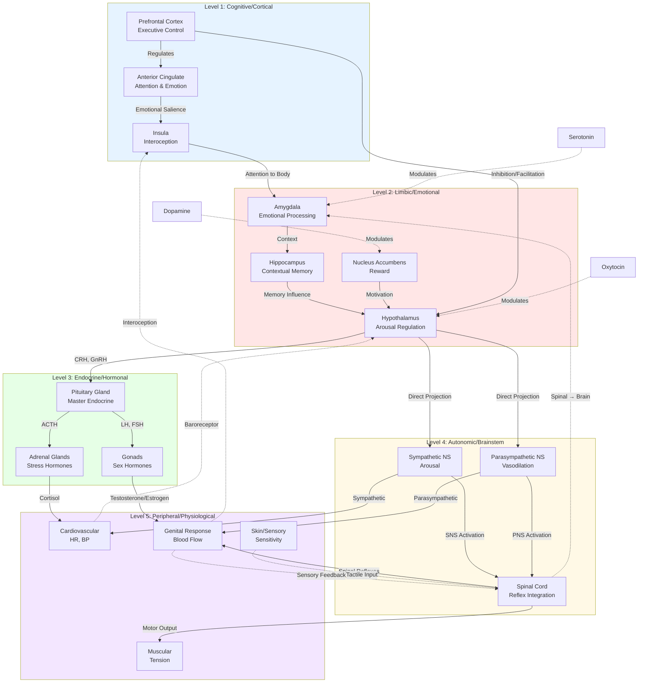

# Hierarchical Architecture of Sexual Arousal Systems

This diagram illustrates the multi-level organization of sexual arousal, from high-level cognitive processing down to peripheral physiological responses.

## Hierarchical Organization

Sexual arousal is organized in a nested hierarchy where higher levels modulate lower levels, and lower levels provide feedback to higher levels.

---

## Level 1: Cognitive/Cortical (Blue)

### Function
High-level cognitive processing, conscious awareness, and executive control of arousal.

### Key Regions

#### **Prefrontal Cortex (PFC)**
- **Dorsolateral PFC**: Attention, working memory
- **Ventromedial PFC**: Value assessment, decision-making
- **Orbitofrontal Cortex**: Reward evaluation

**Role in Arousal**:
- **Initiation**: Can trigger arousal through fantasy, imagination
- **Inhibition**: Can suppress arousal (e.g., in inappropriate contexts)
- **Appraisal**: Evaluates sexual stimuli as desirable or not
- **During orgasm**: Deactivates (loss of conscious control)

**Clinical Relevance**:
- Hyperactive PFC can inhibit arousal (overthinking, anxiety)
- Damage can cause disinhibition (inappropriate sexual behavior)

#### **Anterior Cingulate Cortex (ACC)**
- Interface between cognition and emotion
- Allocates attention to arousal-relevant stimuli
- Monitors conflict (e.g., desire vs. social appropriateness)

**Role in Arousal**:
- Directs attention toward sexual stimuli
- Emotional salience tagging
- Conflict resolution when competing motivations exist

**Neuroimaging**: ACC activation consistently found during sexual arousal (Stoléru et al., 2012)

#### **Insula**
- Primary interoceptive cortex
- Represents internal bodily states
- Bridge between bodily sensations and conscious feeling

**Role in Arousal**:
- Creates conscious awareness of physiological arousal
- "I feel aroused" sensation
- Integrates sensory input with emotional state

**Key Finding**: Insula activation correlates with subjective arousal ratings

### Descending Control
- PFC can enhance arousal (sexual fantasy) or inhibit it (distraction)
- Sets context and meaning for lower-level processes
- Voluntary control of attention

### Ascending Feedback
- Interoceptive signals from body → Insula
- Creates conscious experience of arousal
- Informs decision-making about continuing or stopping

---

## Level 2: Limbic/Emotional (Pink)

### Function
Emotional processing, memory integration, and subcortical arousal regulation.

### Key Regions

#### **Amygdala**
- Emotion processing center
- Threat detection and reward signaling
- Contextual emotional memory

**Role in Arousal**:
- Rapid assessment of emotional significance
- Enhanced during arousal (emotional intensity)
- May decrease during orgasm (threat detection off)
- Processes sexual stimuli salience

**Sex Differences**:
- Males: Greater amygdala response to visual sexual stimuli
- Females: More variable, context-dependent

**Clinical**: Amygdala hyperactivity in anxiety-related sexual dysfunction

#### **Hippocampus**
- Declarative memory formation
- Contextual memory retrieval
- Spatial/temporal context

**Role in Arousal**:
- Retrieves sexual memories (past experiences)
- Contextual cues (safe/unsafe environments)
- Associative learning (stimuli → arousal conditioning)
- Novelty detection (novel partners/situations)

**Plasticity**: Sexual experiences shape hippocampal representations

#### **Hypothalamus**
- Master regulator of arousal
- Integrator of neural and hormonal signals
- Small but critical structure

**Subdivisions**:
- **Medial Preoptic Area (MPOA)**: Male sexual behavior integration
- **Ventromedial Nucleus (VMN)**: Female sexual behavior
- **Paraventricular Nucleus (PVN)**: Oxytocin/vasopressin release
- **Arcuate Nucleus**: Endocrine control (GnRH)

**Role in Arousal**:
- Coordinates entire arousal cascade
- Receives sensory, hormonal, and cognitive inputs
- Outputs to autonomic centers and pituitary
- Critical for consummatory sexual behavior

**Sexually Dimorphic**: Structural differences between sexes

#### **Nucleus Accumbens (NAcc)**
- Core of reward system
- Dopaminergic signaling
- Motivation and "wanting"

**Role in Arousal**:
- Dopamine release creates motivation to pursue sex
- Reinforcement learning (sex is rewarding)
- Anticipatory arousal
- Incentive salience

**Individual Variation**: Dopamine receptor density affects arousal drive

### Descending Control
- Hypothalamus → Pituitary (hormonal cascade)
- Hypothalamus → Brainstem (autonomic activation)
- Amygdala → Physiological arousal via autonomic system

### Ascending Feedback
- Genital sensations → Amygdala (emotional coloring)
- Hormonal levels → Hypothalamus (feedback regulation)

---

## Level 3: Endocrine/Hormonal (Green)

### Function
Hormonal modulation of arousal capacity, desire, and physiological readiness.

### Key Glands

#### **Pituitary Gland**
- "Master gland" controlled by hypothalamus
- **Anterior Pituitary**: Hormone release (LH, FSH, ACTH, prolactin)
- **Posterior Pituitary**: Oxytocin and vasopressin release

**Hormones Released**:
- **LH (Luteinizing Hormone)**: Stimulates testosterone production
- **FSH (Follicle-Stimulating Hormone)**: Spermatogenesis, ovarian function
- **Prolactin**: Inhibits arousal post-orgasm
- **Oxytocin**: Orgasm, bonding, contractions
- **Vasopressin**: Arousal, pair bonding (especially males)

**Arousal Dynamics**:
- **Pre-arousal**: Baseline hormone levels set responsiveness
- **During arousal**: Oxytocin rises gradually
- **Orgasm**: Oxytocin/vasopressin surge
- **Post-orgasm**: Prolactin surge (inhibition)

#### **Adrenal Glands**
- Produce stress hormones and some sex hormones
- **Cortex**: Cortisol, DHEA, small amounts of sex hormones
- **Medulla**: Epinephrine, norepinephrine

**Role in Arousal**:
- **Acute stress**: Epinephrine can enhance arousal (excitement)
- **Chronic stress**: Cortisol inhibits arousal (suppresses GnRH)
- **DHEA**: Precursor to sex hormones

**Stress-Arousal Relationship**:
- Inverted U-curve: Moderate arousal optimal, too high or low impairs

#### **Gonads**
- **Testes (males)**: Testosterone production
- **Ovaries (females)**: Estrogen and progesterone

**Testosterone (all sexes)**:
- Drives sexual desire and motivation
- Increases genital sensitivity
- Primes neural arousal circuits
- Levels peak in morning (circadian rhythm)

**Estrogen (primarily females)**:
- Enhances vaginal blood flow and lubrication
- Increases sensitivity
- Neuroprotective effects
- Varies across menstrual cycle (peaks mid-cycle)

**Progesterone (primarily females)**:
- Generally inhibitory to arousal
- High in luteal phase (post-ovulation)

### Descending Control
- Hormones act on brain (hormone receptors in hypothalamus, amygdala)
- Testosterone/estrogen sensitize neural arousal circuits
- Cortisol inhibits sexual behavior circuits

### Ascending Feedback
- **HPG Axis Feedback**: Sex hormones feedback to hypothalamus/pituitary
- **HPA Axis Feedback**: Cortisol regulates its own production
- Negative feedback maintains homeostasis

---

## Level 4: Autonomic/Brainstem (Yellow)

### Function
Involuntary control of physiological arousal responses.

### Key Systems

#### **Sympathetic Nervous System (SNS)**
- "Fight or flight" system
- Arousal and activation

**Effects on Sexual Arousal**:
- **Cardiovascular**: Increased heart rate, blood pressure
- **Respiratory**: Faster breathing
- **Pupil**: Dilation
- **Metabolic**: Energy mobilization
- **Skin**: Flushing, sweating

**Neurotransmitters**: Norepinephrine, epinephrine

**Paradox**: Too much SNS activation (anxiety) can inhibit genital response

#### **Parasympathetic Nervous System (PNS)**
- "Rest and digest" system
- Critical for genital arousal

**Effects on Sexual Arousal**:
- **Genital vasodilation**: Erection, clitoral engorgement
- **Lubrication**: Vaginal transudation
- **Mediated by**: Nitric oxide → cGMP pathway

**Sacral Parasympathetic**:
- S2-S4 spinal segments
- Pelvic nerve (nervi erigentes)

**Key Insight**: Genital arousal requires PNS, but orgasm requires SNS

#### **Spinal Cord**
- Reflex integration center
- Semi-autonomous sexual reflexes

**Spinal Reflexes**:
- **Genital-spinal reflexes**: Touch → arousal
- **Ejaculation reflex**: Coordinated SNS/PNS
- **Orgasm contractions**: Rhythmic motor output

**Spinal Levels**:
- **T11-L2**: Sympathetic outflow (ejaculation, orgasm)
- **S2-S4**: Parasympathetic outflow (erection, lubrication)

**Clinical**: Spinal cord injury can disrupt arousal depending on level

### Descending Control
- Hypothalamus → Sympathetic/parasympathetic centers in brainstem/spinal cord
- Voluntary override limited (autonomic = "automatic")

### Ascending Feedback
- Genital sensory neurons → Spinal cord → Brain
- Baroreceptors (blood pressure) → Brainstem → Hypothalamus
- Interoceptive signals inform brain of arousal state

---

## Level 5: Peripheral/Physiological (Purple)

### Function
End-organ responses that constitute observable arousal.

### Key Systems

#### **Cardiovascular System**
- Heart rate increase: 60-80 → 150-180 bpm
- Blood pressure elevation: +20-100 mmHg
- Cardiac output increase

**Mechanisms**:
- SNS activation (norepinephrine → beta-adrenergic receptors)
- Increased metabolic demand
- Vasodilation in some beds, constriction in others

**Feedback**: Baroreceptors signal brain about cardiovascular state

#### **Genital Response**
- Most specific marker of sexual arousal

**Males**:
- Penile erection via vasocongestion
- Mechanism: PNS → nitric oxide → cGMP → smooth muscle relaxation
- Arterial inflow increases, venous outflow restricted
- Glans engorgement, scrotal tightening

**Females**:
- Clitoral engorgement
- Vaginal lubrication (plasma transudation)
- Labia swelling and color change
- Uterine elevation
- Vaginal expansion and orgasmic platform formation

**Common Pathway**: Nitric oxide signaling

**Clinical**: PDE5 inhibitors (Viagra) enhance cGMP, prolonging vasodilation

#### **Skin/Sensory System**
- Erogenous zones: Genitals, breasts, neck, ears, etc.
- High density of mechanoreceptors and free nerve endings

**Changes During Arousal**:
- Increased tactile sensitivity
- Vasodilation (flushing)
- Sex flush (50-75% of females, 25% of males)
- Nipple erection

**Feedback Loop**:
- Touch stimulation → Spinal cord → Brain
- Brain → Enhanced sensory gain (top-down modulation)
- Creates positive feedback (more sensitive → more arousal)

#### **Muscular System**
- Myotonia: Involuntary muscle tension

**Progression**:
- Gradual tension increase during excitement/plateau
- Peak during orgasm
- Rhythmic contractions at orgasm (0.8-second intervals)
- Rapid relaxation post-orgasm

**Muscles Involved**:
- Pelvic floor muscles
- Abdominal muscles
- Limbs (grasping, pointing toes)
- Facial muscles (grimacing)

---

## Cross-Level Integration

### Top-Down Processing
Higher levels influence lower levels:
- **Cortex → Limbic**: Attention enhances emotional processing
- **Limbic → Endocrine**: Hypothalamus triggers hormone release
- **Endocrine → Periphery**: Hormones sensitize genital tissue
- **Autonomic → Physiological**: SNS/PNS drive peripheral changes

**Example**: Sexual fantasy (Level 1) → Amygdala activation (Level 2) → Hypothalamus (Level 2) → Sympathetic activation (Level 4) → Heart rate increase (Level 5)

### Bottom-Up Processing
Lower levels provide feedback to higher levels:
- **Periphery → Autonomic**: Baroreceptors, sensory neurons
- **Autonomic → Limbic**: Interoceptive signals
- **Hormones → Brain**: Steroid hormones cross blood-brain barrier
- **Limbic → Cortical**: Emotional signals reach consciousness

**Example**: Genital stimulation (Level 5) → Spinal reflexes (Level 4) → Amygdala (Level 2) → Insula (Level 1) → Conscious arousal

### Bidirectional Feedback Loops
Each level both receives and sends:
- **Positive feedback**: Arousal at one level enhances others
- **Negative feedback**: High arousal triggers inhibitory signals
- **Modulatory feedback**: Context adjusts gain at each level

---

## Clinical Implications

### Dysfunction Can Occur at Any Level

**Level 1 (Cognitive)**:
- Distraction, intrusive thoughts
- Performance anxiety
- Hyperactive inhibition
- Treatment: Cognitive-behavioral therapy, mindfulness

**Level 2 (Limbic)**:
- Trauma (amygdala hyperactivity)
- Depression (blunted reward system)
- Anxiety disorders
- Treatment: Psychotherapy, SSRIs (cautiously)

**Level 3 (Endocrine)**:
- Hypogonadism (low testosterone/estrogen)
- Hyperprolactinemia
- Thyroid disorders
- Treatment: Hormone replacement therapy

**Level 4 (Autonomic)**:
- Diabetes (neuropathy)
- Medications (antihypertensives)
- Spinal cord injury
- Treatment: PDE5 inhibitors, nerve-sparing techniques

**Level 5 (Peripheral)**:
- Vascular disease
- Genital surgery/trauma
- Pelvic floor dysfunction
- Treatment: Vascular interventions, pelvic floor therapy

### Multi-Level Interventions

Effective treatment often targets multiple levels:
- **Viagra (PDE5 inhibitor)**: Level 5 (genital blood flow)
- **Testosterone therapy**: Level 3 (hormonal) + Level 2 (brain)
- **Psychotherapy**: Level 1 (cognition) + Level 2 (emotion)
- **Mindfulness**: Level 1 (attention) → Level 5 (interoception)

---

## Neurotransmitter Modulation (Dotted Lines)

Neurotransmitters act across multiple levels:

### **Dopamine**
- Levels: 2 (NAcc), affects 1, 2, 4
- Function: Motivation, reward, "wanting"
- Too little: Low desire
- Too much: Compulsivity

### **Oxytocin**
- Levels: 2 (Hypothalamus), 3 (Pituitary)
- Function: Bonding, orgasm, contractions
- Released: During arousal, surges at orgasm

### **Serotonin**
- Levels: 1, 2
- Function: Generally inhibitory
- High serotonin (SSRIs): Delayed orgasm, reduced desire
- Low serotonin: May enhance arousal

### **Norepinephrine**
- Levels: 4 (Autonomic), affects 1, 2, 5
- Function: Arousal, attention, SNS activation
- Inverted U: Moderate optimal, too high (anxiety) impairs

---

## Research Methods for Studying Hierarchy

### Lesion Studies (Animal Models)
- Selective brain region damage
- Observe effects on sexual behavior
- Establishes necessity of regions

### Brain Stimulation
- Electrical or optogenetic stimulation
- Can trigger arousal from specific regions
- Establishes sufficiency

### Neuroimaging (Human)
- **fMRI**: Spatial mapping of activation
- **PET**: Neurotransmitter activity
- **EEG**: Temporal dynamics
- Reveals correlations across levels

### Pharmacological Manipulation
- Hormone administration
- Neurotransmitter agonists/antagonists
- Tests causal role of neurochemicals

### Psychophysiology
- Simultaneous measurement across levels
- E.g., genital response + brain imaging + hormones
- Reveals integration

---

## Evolutionary Perspective

Hierarchical organization is adaptive:

**Higher Levels (Cortex, Limbic)**:
- Selectivity: Choose appropriate partners
- Contextual appropriateness: Avoid dangerous situations
- Flexibility: Respond to novel situations

**Lower Levels (Autonomic, Peripheral)**:
- Automaticity: Don't require conscious control
- Reliability: Reflexive responses work consistently
- Efficiency: Rapid physiological readiness

**Integration**:
- Higher levels can override lower (e.g., inhibit arousal in danger)
- Lower levels can drive higher (e.g., unexpected touch captures attention)

---

## Key References

- **Georgiadis, J. R., & Kringelbach, M. L. (2012)**. "The human sexual response cycle: brain imaging evidence linking sex to other pleasures." *Progress in Neurobiology*, 98(1), 49-81.

- **Stoléru, S., et al. (2012)**. "Neuroanatomical correlates of visually evoked sexual arousal in human males." *Archives of Sexual Behavior*, 41(4), 825-853.

- **Komisaruk, B. R., et al. (2011)**. *The Orgasm Answer Guide*. Johns Hopkins University Press.

- **Pfaus, J. G., et al. (2012)**. "Who, what, where, when (and maybe even why)? How the experience of sexual reward connects sexual desire, preference, and performance." *Archives of Sexual Behavior*, 41(1), 31-62.

---

**Last Updated**: 2025-11-19
**Model**: Multi-level hierarchical integration framework
