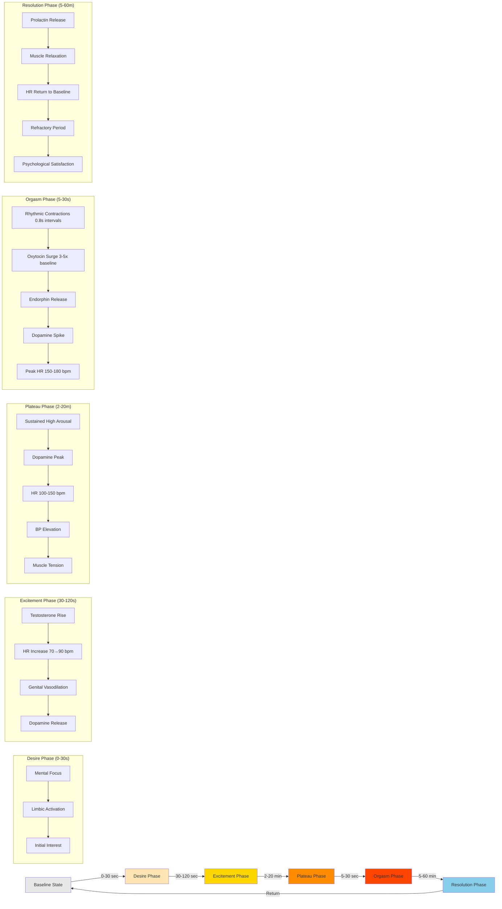

# Temporal Dynamics of Sexual Arousal

This diagram illustrates the time-course of sexual arousal, following the Masters & Johnson sexual response cycle with modern neuroscience additions.



## Detailed Phase Analysis

### Phase 0: Baseline State
**Duration**: Continuous between sexual episodes
**Characteristics**:
- Resting state, no sexual engagement
- Basal hormone levels
- Autonomic nervous system in parasympathetic dominance
- Heart rate: 60-80 bpm (resting)
- No genital vasocongestion

**Neural Activity**:
- Default mode network active
- Limbic system at baseline
- Prefrontal cortex engaged in non-sexual tasks

---

### Phase 1: Desire Phase (0-30 seconds)
**Duration**: 0-30 seconds from initial stimulus
**Trigger**: Sexual stimulus (visual, tactile, fantasy, etc.)

#### Cognitive Components
- **Attention capture**: Sexual stimulus grabs attentional resources
- **Appraisal**: Rapid evaluation of stimulus as sexually relevant
- **Interest**: Motivational state to pursue arousal
- **Fantasy**: Mental imagery may begin

#### Neural Activation
- **Amygdala**: Emotional significance detection
- **Anterior cingulate cortex**: Attention allocation
- **Insula**: Interoceptive awareness begins
- **Hypothalamus**: Arousal regulation initiates

#### Neurochemical Changes
- **Dopamine**: Initial release in nucleus accumbens (wanting)
- **Norepinephrine**: Alertness and attention
- **Testosterone**: Pre-existing levels prime responsiveness

#### Physiological Changes
- Minimal peripheral changes yet
- Pupil dilation may begin
- Heart rate slight increase (70-75 bpm)

**Individual Variation**:
- Highly variable based on context, mood, relationship
- Can be skipped if physical stimulation starts directly
- May last longer with mental/fantasy-based arousal

---

### Phase 2: Excitement Phase (30-120 seconds)
**Duration**: 30 seconds to 2 minutes
**Characteristics**: Rapid escalation of arousal

#### Cardiovascular Changes
- **Heart rate**: 70 → 90-100 bpm
- **Blood pressure**: Moderate increase (10-20 mmHg)
- **Cardiac output**: Increased to support vasodilation

#### Genital Responses
**Males**:
- Penile tumescence (erection onset)
- Scrotal tightening
- Testes elevation

**Females**:
- Vaginal lubrication (transudation)
- Clitoral engorgement
- Labia majora separation
- Uterine elevation

**Mechanism**: Nitric oxide → cGMP → smooth muscle relaxation → vasodilation

#### Respiratory Changes
- Breathing rate increases
- Deeper breathing patterns
- Oxygen consumption rises

#### Skin & Muscle
- Skin flushing may begin (vasodilation)
- Nipple erection
- Muscle tension increases slightly

#### Neural Activity
- **Limbic system**: Full engagement
- **Hypothalamus**: Coordinating autonomic responses
- **Spinal cord**: Genital reflexes activated
- **Prefrontal cortex**: May decrease (reduced executive control)

#### Neurochemical Surge
- **Dopamine**: Continued release, rising levels
- **Testosterone/Estrogen**: Enhanced sensitivity at receptors
- **Oxytocin**: Beginning to rise
- **Vasopressin**: Involved in blood pressure regulation

**Time Course Variation**:
- Typically faster in males (30-60s)
- Often slower in females (1-5 minutes)
- Highly dependent on stimulation quality and context

---

### Phase 3: Plateau Phase (2-20 minutes)
**Duration**: 2-20 minutes (highly variable)
**Characteristics**: Sustained high arousal, pre-orgasmic

#### Physiological Maintenance
- **Heart rate**: 100-150 bpm (sustained)
- **Blood pressure**: Elevated 20-40 mmHg above baseline
- **Breathing**: Rapid (20-40 breaths/min)
- **Muscle tension**: Progressive myotonia throughout body

#### Genital Changes
**Males**:
- Full erection maintained
- Cowper's gland secretion
- Testes fully elevated (50% size increase)
- Color deepening of glans

**Females**:
- Orgasmic platform formation (outer 1/3 vagina swells)
- Clitoris retracts under hood
- Bartholin's gland lubrication
- Labia minora color change (pink → deep red)

#### Neural Dynamics
- **Hypothalamus**: Maximal activation
- **Amygdala**: High activity (emotional intensity)
- **Anterior cingulate**: Processing pleasure/arousal
- **Cerebellum**: May activate (sensorimotor coordination)

#### Neurochemical Peak
- **Dopamine**: Peak levels approaching orgasm
- **Oxytocin**: Rising steadily
- **Norepinephrine**: High (arousal, focus)
- **Serotonin**: May decrease (disinhibition)

#### Psychological State
- Intense focus on sexual stimuli
- Reduced awareness of surroundings
- Time perception altered
- Anticipation of orgasm

**Duration Factors**:
- Stimulation intensity (moderate → longer plateau)
- Experience (practiced individuals can extend)
- Sex differences (females often longer plateau)
- Voluntary control techniques

---

### Phase 4: Orgasm Phase (5-30 seconds)
**Duration**: 5-30 seconds
**Characteristics**: Climactic peak, involuntary muscle contractions

#### Defining Features
- **Rhythmic contractions**: 0.8-second intervals
- **Involuntary**: Cannot be consciously stopped once initiated
- **Subjective intensity**: Described as "peak pleasure"
- **Whole-body**: Effects throughout nervous system

#### Genital Contractions
**Males**:
- Prostate/seminal vesicle contractions
- Urethral contractions (ejaculation)
- 3-7 major contractions, then minor ones
- Sphincter contractions

**Females**:
- Uterine contractions
- Vaginal/pelvic floor contractions (3-15 contractions)
- Anal sphincter contractions
- May be multiple (successive) orgasms

#### Cardiovascular Maximum
- **Heart rate**: 150-180 bpm (peak)
- **Blood pressure**: Maximum elevation (+40-100 mmHg)
- **Breathing**: Hyperventilation possible

#### Neural Activation Pattern
- **Hypothalamus**: Maximum output
- **Ventral tegmental area**: Dopamine surge
- **Amygdala**: May decrease (threat detection off)
- **Prefrontal cortex**: Deactivates (loss of control)
- **Cerebellum**: Activated (motor coordination)
- **Nucleus accumbens**: Peak reward signaling

**Brain Imaging Findings** (Georgiadis et al., 2012):
- Deactivation of lateral orbitofrontal cortex
- Activation of paraventricular nucleus
- Similarity to heroin rush (reward circuits)

#### Neurochemical Explosion
- **Oxytocin**: Surge to 3-5x baseline
  - Stimulates contractions
  - Promotes bonding
  - Released from pituitary

- **Dopamine**: Acute spike
  - Peak pleasure sensation
  - Reinforcement learning

- **Endorphins**: Released
  - Pain reduction
  - Euphoria

- **Prolactin**: Begins rapid rise
  - Will inhibit further arousal

- **Vasopressin**: Increase
  - Blood pressure regulation
  - May contribute to bonding (males)

#### Subjective Experience
- Altered consciousness
- Loss of voluntary control
- Intense pleasure
- Possible vocalizations
- Amnesia for details (memory encoding impaired)

**Sex Differences**:
- **Males**: Typically single orgasm, followed by refractory period
- **Females**: Capable of multiple orgasms without refractory period
- **Mechanism**: Prolactin sensitivity differences

---

### Phase 5: Resolution Phase (5-60 minutes)
**Duration**: 5-60 minutes (highly variable)
**Characteristics**: Return to baseline

#### Immediate Post-Orgasm (0-5 min)
- **Muscle relaxation**: Rapid decrease in myotonia
- **Cardiovascular**: Rapid decline in HR/BP
- **Breathing**: Return to normal rate
- **Skin**: Flushing dissipates
- **Genital**: Detumescence begins

#### Neurochemical Shift
- **Prolactin**: Remains elevated 30-120 minutes
  - Inhibits dopamine neurons
  - Creates subjective "satisfaction"
  - Responsible for refractory period

- **Oxytocin**: Slower decline
  - Promotes bonding, cuddling
  - Facilitates sleep

- **Endorphins**: Gradual decrease
  - Continued relaxation

- **Dopamine**: Returns to baseline
  - Reduced motivation for immediate repeat

#### Refractory Period
**Definition**: Time during which arousal/orgasm cannot be achieved

**Males**:
- Nearly universal
- Duration: 15 minutes to 24+ hours
- Increases with age
  - 20s: 15-30 minutes
  - 40s: 30-60 minutes
  - 60s: Hours to days
- Mediated by prolactin inhibition of dopamine

**Females**:
- Highly variable
- Many have no refractory period (multiorgasmic capacity)
- When present, typically shorter (5-15 min)
- Less prolactin elevation hypothesis

#### Psychological State
- **Satisfaction**: Contentment, fulfillment
- **Relaxation**: Reduced anxiety
- **Bonding**: Enhanced closeness with partner
- **Sleepiness**: Common, especially males
- **Vulnerability**: Emotional openness

#### Return to Baseline (30-60 min)
- All physiological measures return to pre-arousal state
- Genital blood flow normalizes
- Hormone levels stabilize
- Autonomic nervous system: parasympathetic dominance restored

**Clinical Note**: Prolonged resolution or dissatisfaction may indicate dysfunction

---

## Time-Course Graphs

### Heart Rate Progression
```
HR (bpm)
180 |                    ╱╲
160 |                   ╱  ╲
140 |                  ╱    ╲
120 |              ╱╲╱      ╲
100 |          ╱╲╱╲          ╲
 80 |     ╱╲╱╲                ╲___
 60 |____╱                        ╲____
    +----+----+----+----+----+----+----
    0   30  120   5   10  15   30   60 (min)
      Desire Excite Plateau Org Res
```

### Neurotransmitter Levels
```
Level
 ***|               D
  * |              ╱╲
  * |         D   ╱  ╲ P P
  * |        ╱╲  ╱    ╲ ╲
  * |   D   ╱  ╲╱  O   ╲ ╲___
  * |  ╱╲  ╱        ╲   ╲
  * | ╱  ╲╱          ╲___╲___
    +----+----+----+----+----+----
        Desire Excite Plateau Org Res

D = Dopamine
O = Oxytocin
P = Prolactin
```

## Individual & Contextual Variation

### Factors Affecting Timing

**Biological**:
- Age (older = longer refractory, sometimes longer plateau)
- Hormonal status (menstrual cycle, medications)
- Neurological health
- Vascular health

**Psychological**:
- Arousal level / desire
- Stress and anxiety (can prolong or prevent orgasm)
- Depression (often delayed orgasm)
- Relationship satisfaction

**Behavioral**:
- Type of stimulation
- Experience and learning
- Deliberate control techniques (edging)
- Substance use (alcohol, drugs)

**Sex/Gender**:
- Females often slower excitement, longer plateau
- Males often faster excitement, shorter refractory
- Substantial overlap and individual variation

### Clinical Variations

**Premature Ejaculation**:
- Shortened excitement/plateau (< 1 minute)
- Immediate transition to orgasm
- Treatment: SSRIs (increase serotonin, delay), behavioral techniques

**Delayed Ejaculation**:
- Extended plateau (> 30 minutes)
- Difficulty or inability to reach orgasm
- Causes: SSRIs, anxiety, aging

**Anorgasmia**:
- Cannot reach orgasm phase
- Plateau maintained but no climax
- More common in females, often psychological

## Research Methods for Studying Phases

### Subjective Measurement
- **Self-report scales**: Continuous arousal ratings during stimulation
- **Event marking**: Participants indicate phase transitions

### Physiological Measurement
- **Genital plethysmography**: Objective measure of engorgement
- **Cardiovascular monitoring**: HR, BP, HRV
- **Myography**: Muscle tension measurement
- **Thermography**: Skin temperature changes

### Neuroimaging
- **fMRI**: Brain activation patterns per phase (limited temporal resolution)
- **PET**: Neurotransmitter activity (limited temporal resolution)
- **EEG**: High temporal resolution, can track phase transitions

### Endocrine Sampling
- **Blood draws**: Pre/post arousal comparisons
- **Serial sampling**: Multiple timepoints during resolution
- **Saliva samples**: Less invasive, good for repeated measures

## Key References

- **Masters, W. H., & Johnson, V. E. (1966)**. *Human Sexual Response*. Boston: Little, Brown and Company.
  - Original 4-phase model

- **Levin, R. J., & Both, S. (2003)**. "The physiology of female sexual function and the pathophysiology of female sexual dysfunction." *World Journal of Urology*, 21(2), 90-96.
  - Modern physiology review

- **Krüger, T. H., et al. (2003)**. "Orgasm-induced prolactin secretion: feedback control of sexual drive?" *Neuroscience & Biobehavioral Reviews*, 26(1), 31-44.
  - Refractory period mechanism

- **Georgiadis, J. R., et al. (2012)**. "The human sexual response cycle: brain imaging evidence linking sex to other pleasures." *Progress in Neurobiology*, 98(1), 49-81.
  - Neuroimaging across phases

- **Meston, C. M., & Frohlich, P. F. (2000)**. "The neurobiology of sexual function." *Archives of General Psychiatry*, 57(11), 1012-1030.
  - Comprehensive neurobiology

## Evolutionary Perspective

The temporal structure of sexual arousal serves adaptive functions:

- **Desire phase**: Selectivity, ensures appropriate partners/contexts
- **Excitement phase**: Prepares body for intercourse
- **Plateau phase**: Maintains arousal for adequate stimulation/fertilization
- **Orgasm phase**:
  - Males: Ejaculation for reproduction
  - Females: May enhance sperm retention (controversial)
  - Both: Bonding and reinforcement
- **Resolution/Refractory**: Prevents excessive time in vulnerable state

## Practical Implications

### Sexual Health Education
Understanding phases helps:
- Set realistic expectations
- Recognize normal variation
- Identify potential dysfunctions
- Improve communication with partners

### Clinical Applications
Phase model guides:
- Diagnosis of sexual dysfunctions
- Treatment planning (target specific phases)
- Pharmacological interventions
- Behavioral therapy approaches

### Research Applications
Standardizes:
- Experimental protocols
- Timing of measurements
- Cross-study comparisons
- Intervention targeting

---

**Last Updated**: 2025-11-19
**Model Source**: Masters & Johnson (1966) with modern neuroscience integration
