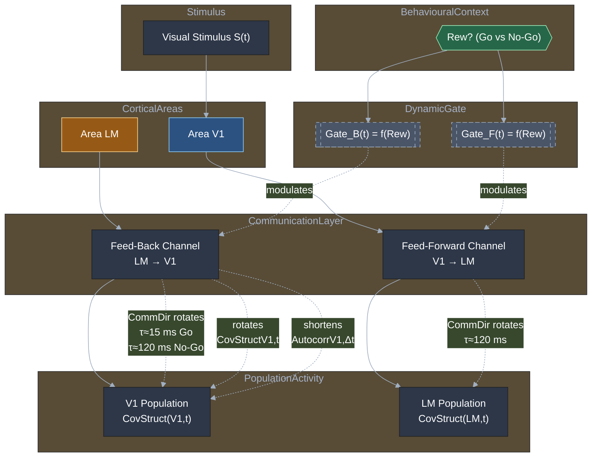
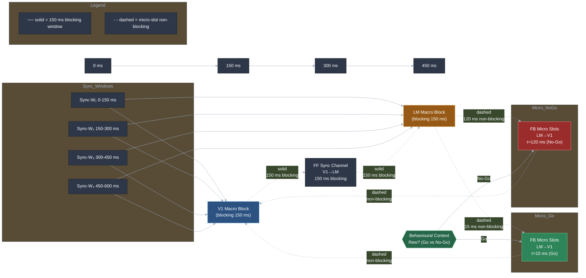
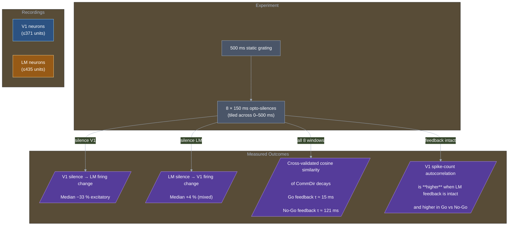

```mermaid
%%{init: {'theme':'base', 'themeVariables': { 'primaryColor': '#2d3748', 'primaryTextColor': '#ffffff', 'lineColor': '#a0aec0', 'textColor': '#ffffff' }}}%%

flowchart TD
    subgraph Stimulus
        S["Visual Stimulus S(t)"]
    end
    
    subgraph BehaviouralContext
        Rew{{"Rew? (Go vs No-Go)"}}
    end
    
    subgraph CorticalAreas
        V1["Area V1"]
        LM["Area LM"]
    end
    
    subgraph CommunicationLayer
        FF["Feed-Forward Channel\nV1 → LM"]
        FB["Feed-Back Channel\nLM → V1"]
    end
    
    subgraph DynamicGate
        G1[["Gate_F(t) = f(Rew)"]]
        G2[["Gate_B(t) = f(Rew)"]]
    end
    
    subgraph PopulationActivity
        V1Pop["V1 Population\nCovStruct(V1,t)"]
        LMPop["LM Population\nCovStruct(LM,t)"]
    end
    
    %% Static wiring
    S --> V1
    V1 --> FF
    FF --> LMPop
    LM --> FB
    FB --> V1Pop
    
    %% Contextual gating
    Rew --> G1
    Rew --> G2
    G1 -.->|modulates| FF
    G2 -.->|modulates| FB
    
    %% Dynamic rotation indicators
    FF -.->|CommDir rotates\nτ≈120 ms| LMPop
    FB -.->|CommDir rotates\nτ≈15 ms Go\nτ≈120 ms No-Go| V1Pop
    
    %% Feedback-specific effects
    FB -.->|rotates\nCovStructV1,t| V1Pop
    FB -.->|shortens\nAutocorrV1,Δt| V1Pop
    
    %% Dark theme styles
    style G1 fill:#4a5568,stroke:#a0aec0,stroke-dasharray: 5 5,color:#ffffff
    style G2 fill:#4a5568,stroke:#a0aec0,stroke-dasharray: 5 5,color:#ffffff
    style Rew fill:#276749,stroke:#9ae6b4,color:#ffffff
    style V1 fill:#2c5282,stroke:#90cdf4,color:#ffffff
    style LM fill:#975a16,stroke:#fbd38d,color:#ffffff
```

```mermaid
%%{init: {'theme':'base', 'themeVariables': { 'primaryColor': '#2d3748', 'primaryTextColor': '#ffffff', 'lineColor': '#a0aec0', 'textColor': '#ffffff' }}}%%

%%  Time axis is left-to-right (0 ms → 500 ms).
%%  Solid arrows = synchronous (blocking) 150 ms windows.
%%  Dashed arrows = non-blocking (asynchronous) 15 ms micro-slots inside each window.
%%  Red vs Green = behavioural context (No-Go vs Go) sets the micro-slot cadence.

flowchart LR
    %% --- Time ruler ----------------------------------------------------------
    T0["0 ms"]
    T1["150 ms"]
    T2["300 ms"]
    T3["450 ms"]
    T0 --> T1 --> T2 --> T3

    %% --- Static 150 ms synchronous windows (blocking) ------------------------
    subgraph Sync_Windows
        SW1["Sync-W₁ 0-150 ms"]
        SW2["Sync-W₂ 150-300 ms"]
        SW3["Sync-W₃ 300-450 ms"]
        SW4["Sync-W₄ 450-600 ms"]
    end

    %% --- V1 & LM macro blocks -------------------------------------------------
    V1_BLOCK["V1 Macro Block\n(blocking 150 ms)"]
    LM_BLOCK["LM Macro Block\n(blocking 150 ms)"]

    SW1 --> V1_BLOCK
    SW1 --> LM_BLOCK
    SW2 --> V1_BLOCK
    SW2 --> LM_BLOCK
    SW3 --> V1_BLOCK
    SW3 --> LM_BLOCK
    SW4 --> V1_BLOCK
    SW4 --> LM_BLOCK

    %% --- Feed-Forward synchronous channel -----------------------------------
    FF_SYNCH["FF Sync Channel\nV1→LM\n150 ms blocking"]

    V1_BLOCK -.->|solid\n150 ms blocking| FF_SYNCH
    FF_SYNCH -.->|solid\n150 ms blocking| LM_BLOCK

    %% --- Feed-Back micro-slot channels ---------------------------------------
    subgraph Micro_Go
        direction TB
        Go_FB["FB Micro Slots\nLM→V1\nτ≈15 ms (Go)"]
    end

    subgraph Micro_NoGo
        direction TB
        NoGo_FB["FB Micro Slots\nLM→V1\nτ≈120 ms (No-Go)"]
    end

    %% Micro-slot arrows (non-blocking, dashed)
    LM_BLOCK -.->|dashed\n15 ms non-blocking| Go_FB
    LM_BLOCK -.->|dashed\n120 ms non-blocking| NoGo_FB

    Go_FB -.->|dashed\nnon-blocking| V1_BLOCK
    NoGo_FB -.->|dashed\nnon-blocking| V1_BLOCK

    %% --- Behavioural context switch ------------------------------------------
    Context{{"Behavioural Context\nRew? (Go vs No-Go)"}}

    Context -->|Go| Go_FB
    Context -->|No-Go| NoGo_FB

    %% --- Legend for arrow styles ---------------------------------------------
    subgraph Legend
        L1["── solid = 150 ms blocking window"]
        L2["- - dashed = micro-slot non-blocking"]
    end

    %% Styling
    style Context fill:#276749,stroke:#9ae6b4,color:#ffffff
    style V1_BLOCK fill:#2c5282,stroke:#90cdf4,color:#ffffff
    style LM_BLOCK fill:#975a16,stroke:#fbd38d,color:#ffffff
    style Go_FB fill:#2f855a,stroke:#68d391,color:#ffffff
    style NoGo_FB fill:#9b2c2c,stroke:#fc8181,color:#ffffff
```

```mermaid
%%{init: {'theme':'base', 'themeVariables': { 'primaryColor': '#2d3748', 'primaryTextColor': '#ffffff', 'lineColor': '#a0aec0', 'textColor': '#ffffff' }}}%%

flowchart TD
    subgraph Experiment
        Stim["500 ms static grating"]
        Silence["8 × 150 ms opto-silences\n(tiled across 0–500 ms)"]
        Stim --> Silence
    end

    subgraph Recordings
        V1["V1 neurons\n(≤371 units)"]
        LM["LM neurons\n(≤435 units)"]
    end

    subgraph "Measured Outcomes"
        %% 1. Feed-forward silencing effects
        FF[/"V1 silence → LM firing change
          <br>Median −33 % excitatory"/]

        %% 2. Feedback silencing effects
        FB[/"LM silence → V1 firing change
          <br>Median +4 % (mixed)"/]

        %% 3. Communication-direction similarity decay
        CommDecay[/"Cross-validated cosine similarity
                   <br>of CommDir decays
                   <br>Go feedback τ ≈ 15 ms
                   <br>No-Go feedback τ ≈ 121 ms"/]

        %% 4. Autocorrelation modulation
        Auto[/"V1 spike-count autocorrelation
               <br>is **higher** when LM feedback is intact
               <br>and higher in Go vs No-Go"/]
    end

    %% Experimental flow
    Silence -->|silence V1| FF
    Silence -->|silence LM| FB
    Silence -->|all 8 windows| CommDecay
    Silence -->|feedback intact| Auto

    %% Styling for dark theme
    style Stim fill:#4a5568,stroke:#a0aec0,color:#ffffff
    style Silence fill:#4a5568,stroke:#a0aec0,color:#ffffff
    style V1 fill:#2c5282,stroke:#90cdf4,color:#ffffff
    style LM fill:#975a16,stroke:#fbd38d,color:#ffffff
    style FF fill:#553c9a,stroke:#b794f4,color:#ffffff
    style FB fill:#553c9a,stroke:#b794f4,color:#ffffff
    style CommDecay fill:#553c9a,stroke:#b794f4,color:#ffffff
    style Auto fill:#553c9a,stroke:#b794f4,color:#ffffff
```
