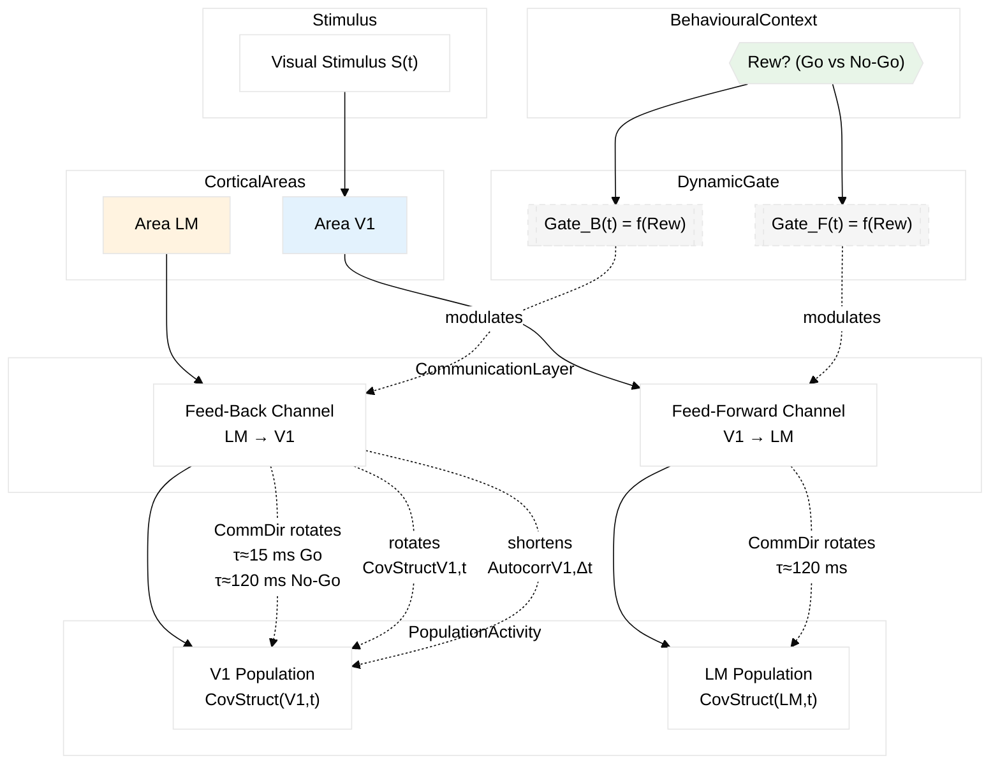

```mermaid
%%{init: {'theme':'base', 'themeVariables': { 'primaryColor': '#ffffff', 'primaryTextColor': '#000000' }}}%%

flowchart TD
    subgraph Stimulus
        S["Visual Stimulus S(t)"]
    end
    
    subgraph BehaviouralContext
        Rew{{"Rew? (Go vs No-Go)"}}
    end
    
    subgraph CorticalAreas
        V1["Area V1"]
        LM["Area LM"]
    end
    
    subgraph CommunicationLayer
        FF["Feed-Forward Channel\nV1 → LM"]
        FB["Feed-Back Channel\nLM → V1"]
    end
    
    subgraph DynamicGate
        G1[["Gate_F(t) = f(Rew)"]]
        G2[["Gate_B(t) = f(Rew)"]]
    end
    
    subgraph PopulationActivity
        V1Pop["V1 Population\nCovStruct(V1,t)"]
        LMPop["LM Population\nCovStruct(LM,t)"]
    end
    
    %% Static wiring
    S --> V1
    V1 --> FF
    FF --> LMPop
    LM --> FB
    FB --> V1Pop
    
    %% Contextual gating
    Rew --> G1
    Rew --> G2
    G1 -.->|modulates| FF
    G2 -.->|modulates| FB
    
    %% Dynamic rotation indicators
    FF -.->|CommDir rotates\nτ≈120 ms| LMPop
    FB -.->|CommDir rotates\nτ≈15 ms Go\nτ≈120 ms No-Go| V1Pop
    
    %% Feedback-specific effects
    FB -.->|rotates\nCovStructV1,t| V1Pop
    FB -.->|shortens\nAutocorrV1,Δt| V1Pop
    
    style G1 fill:#f5f5f5,stroke-dasharray: 5 5
    style G2 fill:#f5f5f5,stroke-dasharray: 5 5
    style Rew fill:#e8f5e8
    style V1 fill:#e3f2fd
    style LM fill:#fff3e0
```
