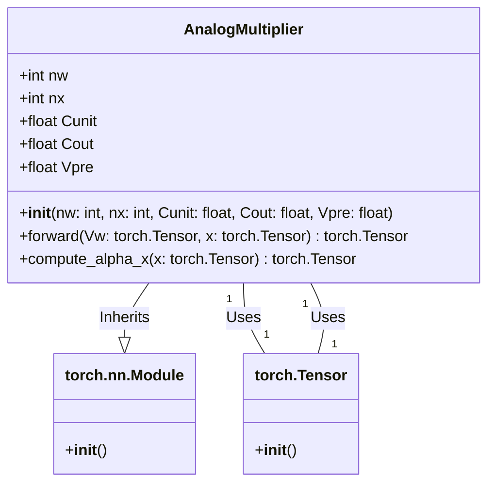

The text you provided discusses the design and operation of an analog multiplier in the context of an In-Memory Computing Unit (IMCU). The analog multiplier performs a nonideal scaling operation by a factor \(\alpha_x\), which is proportional to an input value \(x_n\). The operation involves charge-sharing procedures between capacitors, and the accuracy of the multiplication is influenced by factors such as noise, mismatch, and quantization.

### Key Points from the Text:

1. **Nonideal Scaling Operation:**
   - The scaling factor \(\alpha_x\) is given by a complex expression involving capacitors and input values.
   - The output voltage \(V_{\text{out}}\) is a nonideal multiplication result of the input voltage \(V_w\) and the scaling factor \(\alpha_x\).

2. **Quantization Impact:**
   - The number of weight bits (\(n_w\)) and input bits (\(n_x\)) affects the energy, time, and average power consumed during the analog multiplication operation.
   - Each additional weight bit increases both latency and power consumption linearly, leading to a square dependence on energy consumption.
   - The input bits \(n_x\) have a linear scaling versus energy because the circuit operates for additional cycles without requiring more hardware.

3. **Noise and Mismatch Impact:**
   - The main sources of nonlinearity and noise in the system are thermal \(k_b T/C\) noise and capacitor mismatch due to manufacturing tolerances.
   - The impact of thermal noise is reduced by determining a minimum size for the unit capacitor \(C_{\text{unit}}\).
   - Capacitor mismatch affects the accuracy of charge-sharing procedures, leading to nonideal averaging of capacitor voltages.

4. **Nonlinearity Metrics:**
   - The accuracy of the analog multiplication is quantified using integral nonlinearity (INL) and differential nonlinearity (DNL) metrics.
   - DNL for weight (\(DNL_w\)) and input (\(DNL_x\)) are defined to measure the impact of variations in stored digital values on the analog output voltage \(V_{\text{out}}\).

### Summary:

The analog multiplier in the IMCU is designed to perform a nonideal scaling operation that is influenced by several factors, including quantization, noise, and capacitor mismatch. The accuracy of the multiplication is crucial for the overall performance of the IMCU, and it is quantified using INL and DNL metrics. The design must balance precision, latency, and energy efficiency to achieve optimal performance.

### Example Implementation:

To implement an analog multiplier in a PyTorch model, you would need to simulate the charge-sharing procedures and the effects of noise and mismatch. Here’s a simplified example of how you might model the analog multiplier in PyTorch:

```python
import torch
import torch.nn.functional as F

class AnalogMultiplier(torch.nn.Module):
    def __init__(self, nw, nx, Cunit, Cout, Vpre):
        super(AnalogMultiplier, self).__init__()
        self.nw = nw
        self.nx = nx
        self.Cunit = Cunit
        self.Cout = Cout
        self.Vpre = Vpre

    def forward(self, Vw, x):
        # Simulate the nonideal scaling factor αx
        alpha_x = self.compute_alpha_x(x)
        
        # Compute the nonideal multiplication result Vout
        Vout = Vw * alpha_x
        
        return Vout

    def compute_alpha_x(self, x):
        # Simplified model for αx computation
        # This should be replaced with the actual formula from the text
        alpha_x = (self.Cunit * x) / (self.Cunit + self.Cout)
        return alpha_x

# Example usage
nw = 8  # Number of weight bits
nx = 8  # Number of input bits
Cunit = 1.0  # Unit capacitor value
Cout = 1.0  # Output capacitor value
Vpre = 1.0  # Precharge voltage

analog_multiplier = AnalogMultiplier(nw, nx, Cunit, Cout, Vpre)

# Example input values
Vw = torch.tensor([1.0])  # Input voltage
x = torch.tensor([2.0])  # Input value

# Compute the output voltage
Vout = analog_multiplier(Vw, x)
print(Vout)
```

### Notes:
- The `compute_alpha_x` method in the `AnalogMultiplier` class should be replaced with the actual formula from the text to accurately model the nonideal scaling factor \(\alpha_x\).
- The example assumes simplified values for capacitors and input values. In a real implementation, these values would need to be carefully chosen based on the specific design requirements and constraints.

This example provides a basic framework for modeling an analog multiplier in PyTorch, but it would need to be expanded and refined to fully capture the complexities described in the text.
