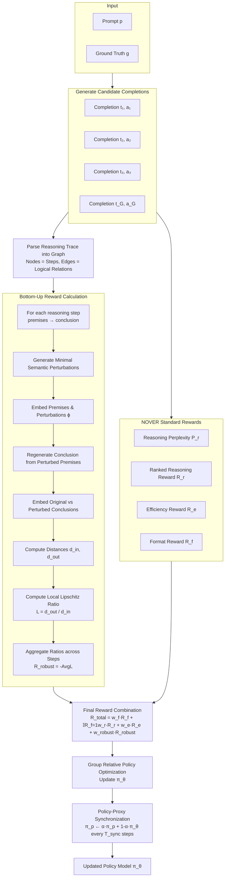

```mermaid
flowchart TD
    subgraph S1 [Input]
        P[Prompt p]
        G[Ground Truth g]
    end

    S1 --> R[Rollout Generation via Policy π_θ]

    subgraph R [Generate Candidate Completions]
        direction LR
        R1[Completion t₁, a₁]
        R2[Completion t₂, a₂]
        R3[Completion t₃, a₃]
        Rn[Completion t_G, a_G]
    end

    R --> PG[Parse Reasoning Trace into Graph<br>Nodes = Steps, Edges = Logical Relations]

    %% Bottom-Up Path
    PG --> LBR[Lipschitz-Based Robustness Reward]
    
    subgraph LBR [Bottom-Up Reward Calculation]
        direction TB
        SG[For each reasoning step<br>premises → conclusion]
        SG --> PERT[Generate Minimal Semantic Perturbations]
        PERT --> EG[Embed Premises & Perturbations ϕ]
        EG --> FG[Regenerate Conclusion from Perturbed Premises]
        FG --> EG2[Embed Original vs Perturbed Conclusions]
        EG2 --> DIST[Compute Distances d_in, d_out]
        DIST --> L[Compute Local Lipschitz Ratio<br>L = d_out / d_in]
        L --> AR[Aggregate Ratios across Steps<br>R_robust = -AvgL]
    end

    %% Top-Down Path
    R --> TR[Top-Down Reward Calculation]
    
    subgraph TR [NOVER Standard Rewards]
        direction LR
        PR[Reasoning Perplexity P_r]
        RR[Ranked Reasoning Reward R_r]
        ER[Efficiency Reward R_e]
        FR[Format Reward R_f]
    end

    %% Combine Rewards
    LBR --> CR
    TR --> CR
    CR[Final Reward Combination<br>R_total = w_f·R_f + 𝕀R_f=1w_r·R_r + w_e·R_e + w_robust·R_robust]

    CR --> GRPO[Group Relative Policy Optimization<br>Update π_θ]

    GRPO --> Sync[Policy-Proxy Synchronization<br>π_p ← α·π_p + 1-α·π_θ every T_sync steps]

    Sync --> Final[Updated Policy Model π_θ]
```
