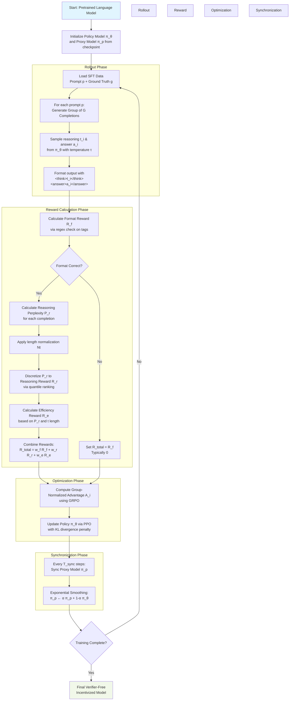

```mermaid
flowchart TD
    A[Start: Pretrained Language Model] --> B[Initialize Policy Model π_θ<br>and Proxy Model π_p from checkpoint]
    B --> C[Load SFT Data<br>Prompt p + Ground Truth g]

    subgraph Rollout Phase
        C --> D[For each prompt p:<br>Generate Group of G Completions]
        D --> E[Sample reasoning t_i & answer a_i<br>from π_θ with temperature τ]
        E --> F[Format output with<br>&lt;think&gt;t_i&lt;/think&gt;<br>&lt;answer&gt;a_i&lt;/answer&gt;]
    end

    subgraph Reward Calculation Phase
        F --> G[Calculate Format Reward R_f<br>via regex check on tags]
        G --> H{Format Correct?}
        H -- Yes --> I[Calculate Reasoning Perplexity P_r<br>for each completion]
        I --> J[Apply length normalization Nt]
        J --> K[Discretize P_r to Reasoning Reward R_r<br>via quantile ranking]
        K --> L[Calculate Efficiency Reward R_e<br>based on P_r and t length]
        L --> M[Combine Rewards:<br>R_total = w_f R_f + w_r R_r + w_e R_e]
        H -- No --> N[Set R_total = R_f<br>Typically 0]
    end

    subgraph Optimization Phase
        M --> O[Compute Group-Normalized Advantage A_i<br>using GRPO]
        N --> O
        O --> P[Update Policy π_θ via PPO<br>with KL divergence penalty]
    end

    subgraph Synchronization Phase
        P --> Q[Every T_sync steps:<br>Sync Proxy Model π_p]
        Q --> R[Exponential Smoothing:<br>π_p ← α π_p + 1-α π_θ]
    end

    R --> S{Training Complete?}
    S -- No --> C
    S -- Yes --> T[Final Verifier-Free<br>Incentivized Model]

    style A fill:#e1f5fe
    style T fill:#f1f8e9
    style Rollout Phase fill:#f3e5f5
    style Reward Calculation Phase fill:#ffecb3
    style Optimization Phase fill:#e8f5e9
    style Synchronization Phase fill:#ffcdd2
```
