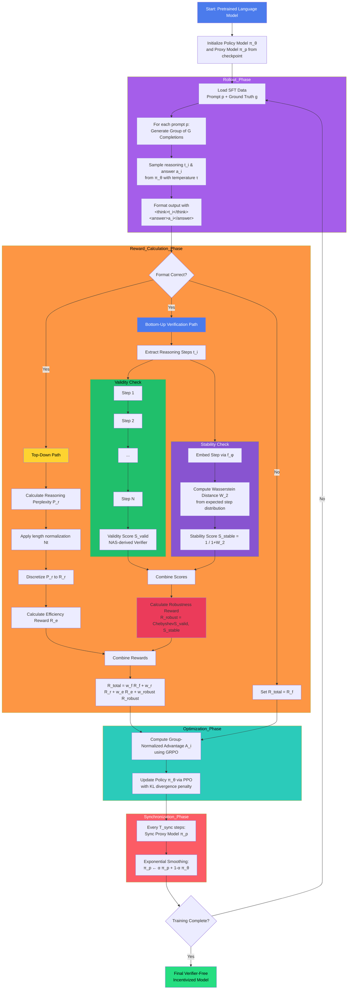

```mermaid
flowchart TD
    A[Start: Pretrained Language Model] --> B[Initialize Policy Model π_θ<br>and Proxy Model π_p from checkpoint]
    B --> C[Load SFT Data<br>Prompt p + Ground Truth g]

    subgraph Rollout_Phase
        C --> D[For each prompt p:<br>Generate Group of G Completions]
        D --> E[Sample reasoning t_i & answer a_i<br>from π_θ with temperature τ]
        E --> F[Format output with<br>&lt;think&gt;t_i&lt;/think&gt;<br>&lt;answer&gt;a_i&lt;/answer&gt;]
    end

    subgraph Reward_Calculation_Phase
        F --> H{Format Correct?}
        
        H -- Yes --> TOP[Top-Down Path]
        H -- Yes --> BOT[Bottom-Up Verification Path]
        H -- No --> N[Set R_total = R_f]

        TOP --> I[Calculate Reasoning Perplexity P_r]
        I --> J[Apply length normalization Nt]
        J --> K[Discretize P_r to R_r]
        K --> L[Calculate Efficiency Reward R_e]
        
        BOT --> B1[Extract Reasoning Steps t_i]
        B1 --> B2[Validity Check]
        B1 --> B3[Stability Check]
        
        subgraph B2[Validity Check]
            B21[Step 1] --> B22[Step 2] --> B23[...] --> B24[Step N]
            B24 --> B25[Validity Score S_valid<br>NAS-derived Verifier]
        end
        
        subgraph B3[Stability Check]
            B31[Embed Step via f_φ] --> B32[Compute Wasserstein Distance W_2<br>from expected step distribution]
            B32 --> B33[Stability Score S_stable = 1 / 1+W_2]
        end
        
        B25 --> CMB
        B33 --> CMB
        CMB[Combine Scores] --> R_robust[Calculate Robustness Reward<br>R_robust = ChebyshevS_valid, S_stable]
        
        L --> M
        R_robust --> M[Combine Rewards]
        
        M --> R_total[R_total = w_f R_f + w_r R_r + w_e R_e + w_robust R_robust]
    end

    subgraph Optimization_Phase
        R_total --> O[Compute Group-Normalized Advantage A_i<br>using GRPO]
        N --> O
        O --> P[Update Policy π_θ via PPO<br>with KL divergence penalty]
    end

    subgraph Synchronization_Phase
        P --> Q[Every T_sync steps:<br>Sync Proxy Model π_p]
        Q --> R[Exponential Smoothing:<br>π_p ← α π_p + 1-α π_θ]
    end

    R --> S{Training Complete?}
    S -- No --> C
    S -- Yes --> T[Final Verifier-Free<br>Incentivized Model]

    style A fill:#4b7bec,color:#ffffff
    style T fill:#26de81,color:#000000
    style Rollout_Phase fill:#a55eea,color:#ffffff
    style Reward_Calculation_Phase fill:#fd9644,color:#000000
    style Optimization_Phase fill:#2bcbba,color:#000000
    style Synchronization_Phase fill:#fc5c65,color:#ffffff
    style TOP fill:#fed330,color:#000000
    style BOT fill:#4b7bec,color:#ffffff
    style B2 fill:#20bf6b,color:#000000
    style B3 fill:#8854d0,color:#ffffff
    style R_robust fill:#eb3b5a,color:#ffffff```
```
