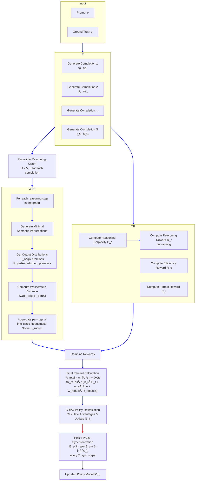

```mermaid
flowchart TD
    subgraph S1 [Input]
        P[Prompt p]
        G[Ground Truth g]
    end

    S1 --> R[Rollout Generation<br>via Policy Model π_θ]

    subgraph R
        direction LR
        R1[Generate Completion 1<br>tâ‚, aâ‚]
        R2[Generate Completion 2<br>tâ‚‚, aâ‚‚]
        R3[Generate Completion ...]
        R4[Generate Completion G<br>t_G, a_G]
    end

    R --> PG[Parse into Reasoning Graph<br>G = V, E for each completion]

    PG --> WBR[Wasserstein Bottom-Up Reward]
    
    subgraph WBR
        direction TB
        SG[For each reasoning step<br>in the graph]
        SG --> PERT[Generate Minimal<br>Semantic Perturbations]
        PERT --> DIST[Get Output Distributions<br>P_orig·premises<br>P_pert·perturbed_premises]
        DIST --> WASS[Compute Wasserstein Distance<br>W&#40;P_orig, P_pert&#41;]
        WASS --> AR[Aggregate per-step W<br>into Trace Robustness Score R_robust]
    end

    WBR --> CR[Combine Rewards]
    
    R --> TR[Top-Down Reward Calculation]
    
    subgraph TR
        direction LR
        PR[Compute Reasoning Perplexity P_r]
        PR --> RR[Compute Reasoning Reward R_r<br>via ranking]
        ER[Compute Efficiency Reward R_e]
        FR[Compute Format Reward R_f]
    end

    TR --> CR

    CR --> FRW[Final Reward Calculation<br>R_total = w_f·R_f + ğ•€&#40;R_f=1&#41;·&#40;w_r·R_r + w_e·R_e + w_robust·R_robust&#41;]

    FRW --> GRPO[GRPO Policy Optimization<br>Calculate Advantages & Update π_θ]

    GRPO --> Sync[Policy-Proxy Synchronization<br>π_p ↠α·π_p + 1-α·π_θ<br>every T_sync steps]

    Sync --> Final[Updated Policy Model π_θ]
    
    %% Style Links
    linkStyle 0,1,2,3,4,5,6,7,8,9,10,11,12 stroke:blue,stroke-width:2px;
    linkStyle 13 stroke:red,stroke-width:3px;
```
