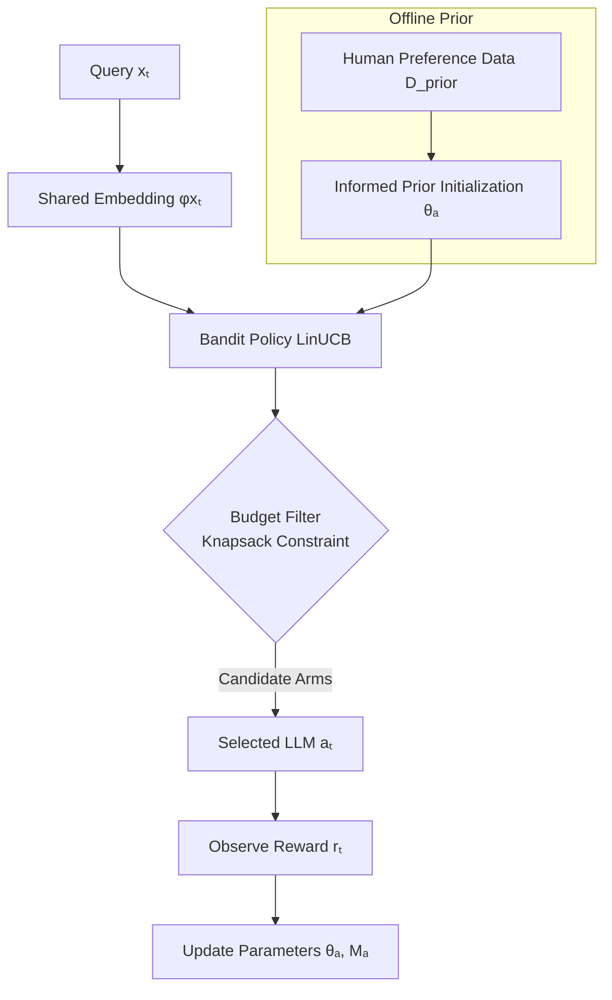

From *Adaptive LLM Routing under Budget Constraints* (https://arxiv.org/pdf/2508.21141)
---

# Symbolic Logic Recasting of *Adaptive LLM Routing under Budget Constraints*

## 1. Core Problem

We want a router that selects an LLM per query under performance–cost tradeoffs.

* **Query:**
  $x \in X$ (embedding-based feature vector)

* **LLM pool:**
  $A = \{a_1, \dots, a_k\}$

* **Cost function:**
  $cost(x, a) \to c \in \mathbb{R}^+$

* **Performance function:**
  $perf(x, a) \to r \in [0,1]$

* **Bandit feedback:**
  At round $t$, only observe reward for the chosen pair:
  $r_t = perf(x_t, a_t) + \epsilon$

* **Objective:**

  $$
  \max_{a_1, \dots, a_T} \sum_{t=1}^T perf(x_t, a_t) 
  \quad \text{s.t.} \quad 
  \sum_{t=1}^T cost(x_t, a_t) \leq B
  $$

---

## 2. Contrast with Prior Work

* **Supervised Routing (impractical):**

  $$
  \forall x \in X, \exists a^* \in A: a^* = \arg\max_{a} perf(x,a)
  $$

  Router requires a dataset $D = \{(x_i, a^*_i)\}$.
  **Problem:** Dataset is unachievable in practice (must query all models for all inputs).

* **Contextual Bandit Routing (realistic):**

  $$
  router_{bandit}(x_t, H_{t-1}) \to a_t
  $$

  Learns from online partial feedback only, minimizing regret:

  $$
  R(T) = \sum_{t=1}^T [perf(x_t, a^*) - perf(x_t, a_t)]
  $$

---

## 3. PILOT’s Algorithmic Logic

### (a) Shared Embedding Space

$$
E[r|x,a] = \phi(x)^T \theta_a
$$

where $\phi(x)$ is query embedding, $\theta_a$ is arm vector.

### (b) Informed Prior (offline human preference)

$$
\theta_a \approx \arg\min_\theta \sum_{(x,a_{pref},a_{not})} 
L(\phi(x)^T (\theta_{a_{pref}} - \theta_{a_{not}}))
$$

Encourages alignment with offline judgments.

### (c) Online LinUCB Update

$$
\hat{\mu}(x_t,a) = \phi(x_t)^T \hat{\theta}_a
$$

$$
\hat{\sigma}(x_t,a) = \alpha \sqrt{\phi(x_t)^T M_a^{-1} \phi(x_t)}
$$

$$
a_t = \arg\max_a [\hat{\mu}(x_t,a) + \hat{\sigma}(x_t,a)]
$$

### (d) Online Budget Policy (Knapsack Constraint)

$$
A_{cand} = \{a \in A \mid cost(x_t,a) \leq B_{rem}\}
$$

$$
a_t = \arg\max_{a \in A_{cand}} [\hat{\mu}(x_t,a) + \hat{\sigma}(x_t,a)]
$$

Dynamic filtering ensures $\sum cost(x_t,a_t) \leq B$.

---

## 4. Logical Meta-Summary

$$
\neg(\exists D \; supervised\_router\ feasible) \;\land\;
(\exists Policy \; bandit\_router(x,H)) \;\land\;
(PILOT \equiv bandit + embedding + informed\ prior + budget\ policy)
\;\Rightarrow\;
\big( \sum perf \text{ high} \;\land\; \sum cost \leq B \big)
$$

---

## 5. Empirical Claims in Logic Form

1. **Efficiency (Routing vs Inference):**

   $$
   time(PILOT) \ll time(GPT\!-\!4)
   $$

   (10×–38× faster routing overhead negligible vs inference)

2. **Performance under Budgets:**

   $$
   \forall b \in \{0.25,0.5,1.0,1.5\}, \; perf(PILOT|b) \geq perf(offline\ policy|b)
   $$

   Online adaptive knapsack beats offline hindsight-tuned policy.

3. **Budget–Performance Frontier:**

   $$
   perf(PILOT) \approx 0.93 \times perf(GPT\!-\!4) 
   \quad \text{at} \quad cost \approx 0.25 \times cost(GPT\!-\!4)
   $$

---

## 6. Modal Framing (Counterfactual Worlds)

* □ (In all worlds with full data): supervised routing possible, but cost → ∞.
* ◇ (In some worlds with only bandit feedback): supervised routing impossible.
* □ (In all accessible budget-constrained worlds): PILOT achieves near-optimal tradeoff.

---

✅ This recasting shows that **PILOT is the unique fixed point between feasibility (bandit feedback), efficiency (fast routing), and constraint satisfaction (budget-aware knapsack).**

---
